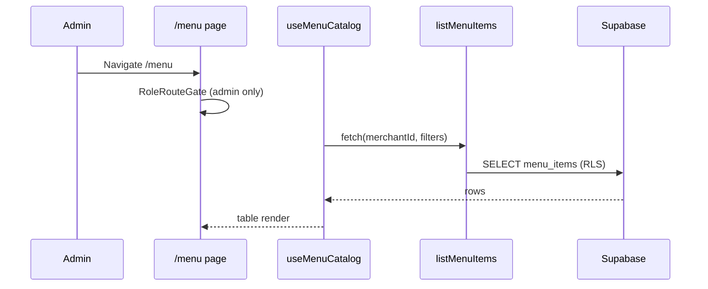

# Design — Menu Items CRUD

## Overview

```
(app)/menu/page.tsx  (view container)
  → menu/presentation/MenuCatalogView.tsx
    → menu/infrastructure/query-adapters.ts
      → menu/infrastructure/menu-item-actions.ts (server)
        → menu/application/use-cases.ts
          → menu/domain/validations.ts
          → menu/infrastructure/supabase-menu-repo.ts
            → Supabase menu_items (RLS: tenant SELECT, admin INSERT/UPDATE)

Orders (unchanged read path):
  orders/infrastructure/supabase-menu-catalog-repo.ts
    → SELECT … WHERE is_active = true
    → invalidated via ['menu-items', merchantId] after menu mutations
```

New bounded context: **`src/domains/menu/`**. Orders does **not** own catalog mutations.

## User flows

### Flow A — Admin lists catalog



### Flow B — Admin creates item

1. Admin clicks **"Nuevo ítem"** → Dialog opens.
2. Fields: **Nombre**, **Tipo** (select: Plato de carne / Bebida / Contorno), conditional **Proteína** + **Porción (etiqueta)** for meat plate, **Precio (USD)**.
3. Submit → `createMenuItemAction` → use case validates FR-2 → INSERT.
4. For `meat_plate`, dialog shows info alert linking to `/waste` (no recipe insert).
5. Dialog closes; invalidate `menu-catalog`, `menu-items`, `meat-plate-costing` keys.

### Flow C — Admin edits item

1. Row action **Editar** → Dialog with name, price, protein/weight (if meat plate), read-only tipo.
2. Submit → `updateMenuItemAction` → UPDATE.
3. Optional **Desactivar ítem** (destructive) with confirm.
4. Cache invalidation same as Flow B.

### Flow D — Admin deactivates / reactivates

1. **Desactivar:** sets `is_active = false`; row hidden when filter active-only.
2. Enable **Mostrar inactivos** → inactive rows with badge **Inactivo** and **Reactivar** button.
3. **Reactivar:** `reactivateMenuItem` use case sets `is_active = true` (respect unique name constraint OQ-3).

### Flow E — Waiter catalog after admin change

1. Admin changes price or deactivates Coca-Cola.
2. Waiter on `/orders` refetches `useMenuItems` (stale invalidated) — updated price or absent item.
3. In-flight cart local state may still reference old price until refresh — acceptable MVP; optional toast "Catálogo actualizado" is stretch.

### Flow F — Non-admin blocked

1. `grill_master` navigates to `/menu` → `resolveRoleRedirect` → `/kitchen`.
2. Sidebar omits **Menú** for non-admin roles.

## Data model

### Table: `menu_items` (existing — no new columns)

| Column | Type | Notes |
|--------|------|-------|
| `id` | UUID PK | |
| `merchant_id` | UUID FK | tenant |
| `name` | VARCHAR(255) NOT NULL | |
| `price` | DECIMAL(10,2) NOT NULL | ≥ 0 (FR-11) |
| `is_active` | BOOLEAN NOT NULL DEFAULT true | soft lifecycle |
| `created_at` | TIMESTAMPTZ | read-only |
| `item_kind` | `menu_item_kind` ENUM | `meat_plate`, `drink`, `side` |
| `protein_group` | TEXT NULL CHECK IN (`beef`,`pork`,`chicken`) | meat plates only |
| `weight_label` | TEXT NULL | meat plates only |

**Domain mapping:**

| DB column | Domain field |
|-----------|--------------|
| `merchant_id` | `merchantId` |
| `item_kind` | `itemKind` |
| `protein_group` | `proteinGroup` |
| `weight_label` | `weightLabel` |
| `is_active` | `isActive` |
| `created_at` | `createdAt` |

### FK impact (why no hard DELETE)

| Child table | ON DELETE | Implication |
|-------------|-----------|-------------|
| `order_items.menu_item_id` | (default RESTRICT) | Historical orders block DELETE |
| `order_item_sides.side_menu_item_id` | (default RESTRICT) | Side references block DELETE |
| `recipe_ingredients.menu_item_id` | CASCADE | Hard delete would drop recipes silently — forbidden in app |
| `menu_item_costing.menu_item_id` | CASCADE | Hard delete would drop costing — forbidden in app |

### Migration (new file)

File: `supabase/migrations/<timestamp>_menu_items_admin_rls.sql`

**Steps:**

1. Add CHECK (if not present):

```sql
ALTER TABLE menu_items
  ADD CONSTRAINT menu_items_price_non_negative
  CHECK (price >= 0);
```

2. Partial unique index (OQ-3):

```sql
CREATE UNIQUE INDEX idx_menu_items_merchant_name_active
  ON menu_items (merchant_id, lower(trim(name)))
  WHERE is_active = true;
```

3. RLS policies:

```sql
CREATE POLICY "Admins can insert menu items for their merchant"
ON menu_items FOR INSERT TO authenticated
WITH CHECK (
  merchant_id = get_user_merchant_id()
  AND get_user_role() = 'admin'
);

CREATE POLICY "Admins can update menu items for their merchant"
ON menu_items FOR UPDATE TO authenticated
USING (merchant_id = get_user_merchant_id())
WITH CHECK (
  merchant_id = get_user_merchant_id()
  AND get_user_role() = 'admin'
);
```

4. **Do not** add DELETE policy for authenticated roles.

**Apply locally:**

```bash
pnpm dlx supabase migration new menu_items_admin_rls
pnpm dlx supabase db reset
pnpm dlx supabase gen types typescript --local > src/shared/infrastructure/database/supabase.types.ts
```

### Downstream consumers

| Consumer | Query | After menu CRUD |
|----------|-------|-----------------|
| Orders cart | `listActiveMenu`, key `['menu-items', merchantId]` | Invalidate on mutation |
| Waste costing | active `meat_plate`, key `['meat-plate-costing', merchantId]` | Invalidate on mutation |
| Kitchen display | Joins order lines to catalog names by id | Live name from DB |

## Domain layer (`src/domains/menu/domain/`)

### Entities (`entities.ts`)

```typescript
export type MenuItemKind = "meat_plate" | "drink" | "side";
export type ProteinGroup = "beef" | "pork" | "chicken";

export interface MenuItem {
  id: string;
  merchantId: string;
  name: string;
  price: number;
  itemKind: MenuItemKind;
  proteinGroup: ProteinGroup | null;
  weightLabel: string | null;
  isActive: boolean;
  createdAt: Date;
}
```

**Note:** Orders domain currently duplicates `MenuItem` in `orders/domain/entities.ts`. For MVP, keep both types structurally aligned; menu context owns catalog mutations. Optional follow-up: shared kernel type — **out of scope** unless implementer uses a thin re-export without cross-domain business logic imports.

### Validations (`validations.ts`)

Zod schemas:

- `createMenuItemInputSchema` — includes `itemKind`; cross-field refine for FR-2
- `updateMenuItemInputSchema` — omits `itemKind`; same cross-field rules for protein/weight vs kind loaded from repo
- `mapZodIssuesToFieldErrors` — consistent with auth/raw-materials

Export pure helper:

```typescript
export function assertKindFieldRules(itemKind: MenuItemKind, proteinGroup: ProteinGroup | null, weightLabel: string | null): void;
```

Vitest: meat plate missing fields, drink with protein, side with weight, price negative, name trim/length.

### Errors

`MenuItemError` (or `Result` pattern) with codes: `FORBIDDEN`, `NOT_FOUND`, `VALIDATION`, `DUPLICATE_NAME`, `KIND_IMMUTABLE`.

### Repository port (`repository.ts`)

```typescript
export interface MenuItemRepository {
  listByMerchant(
    merchantId: string,
    filters?: { activeOnly?: boolean },
  ): Promise<MenuItem[]>;
  getById(id: string): Promise<MenuItem | null>;
  create(input: CreateMenuItemPayload): Promise<MenuItem>;
  update(id: string, input: UpdateMenuItemPayload): Promise<MenuItem>;
  setActive(id: string, isActive: boolean): Promise<MenuItem>;
}
```

`setActive` covers deactivate and reactivate (single code path).

## Application layer (`application/use-cases.ts`)

| Use case | Actor check | Notes |
|----------|-------------|-------|
| `listMenuItems(profile, filters, repo)` | admin | default `activeOnly: false` for admin route |
| `createMenuItem(input, profile, repo)` | admin | validate FR-2 |
| `updateMenuItem(id, input, profile, repo)` | admin | load kind; reject kind change |
| `deactivateMenuItem(id, profile, repo)` | admin | `setActive(false)` |
| `reactivateMenuItem(id, profile, repo)` | admin | `setActive(true)`; surface unique violation |

Reuse `SessionProfile` from auth domain.

## Infrastructure

### Supabase repository (`supabase-menu-repo.ts`)

- Maps snake_case ↔ camelCase
- `listByMerchant` optional filter `.eq('is_active', true)` when `activeOnly`
- Order by `item_kind`, then `name` (or name only — match UI)
- No business rules beyond mapping

### Server actions (`menu-item-actions.ts`)

Pattern: `staff-user-action.ts` / raw-materials actions.

- `createMenuItemAction`
- `updateMenuItemAction`
- `deactivateMenuItemAction`
- `reactivateMenuItemAction`
- `listMenuItemsAction` (admin list)

Each: `"use server"` → `getServerSessionProfile()` → use case → Spanish mapped errors (duplicate name, forbidden role).

### Query adapters (`query-adapters.ts`)

```typescript
export function menuCatalogQueryKey(merchantId: string, filters?: { activeOnly?: boolean }) {
  return ["menu-catalog", merchantId, filters ?? {}] as const;
}

export function useMenuCatalog(merchantId, filters)
export function useCreateMenuItem(merchantId)
export function useUpdateMenuItem(merchantId)
export function useDeactivateMenuItem(merchantId)
export function useReactivateMenuItem(merchantId)
```

**Invalidation helper** (internal):

```typescript
function invalidateMenuConsumers(queryClient, merchantId: string) {
  queryClient.invalidateQueries({ queryKey: ["menu-catalog", merchantId] });
  queryClient.invalidateQueries({ queryKey: ["menu-items", merchantId] });
  queryClient.invalidateQueries({ queryKey: ["meat-plate-costing", merchantId] });
}
```

Import `menuItemsQueryKey` from orders adapter **only in infrastructure** for key consistency (or duplicate string literal with comment — prefer importing the exported key function from orders infrastructure to avoid drift).

### Orders thin adapter (refactor optional)

Keep `createMenuCatalogRepository` in `orders/infrastructure/supabase-menu-catalog-repo.ts`:

- `listActiveMenu` unchanged SELECT
- Optionally extract `mapMenuItemRow` to `menu/infrastructure/menu-item-row-mapper.ts` imported by both repos (infrastructure-only shared file under menu or `shared/infrastructure/database/mappers`)

Do **not** move `MenuCatalogRepository` port to menu domain — orders application continues to depend on orders port.

## Presentation & UI

Follow [DESIGN.md](../../DESIGN.md): flat cards, hairline borders, Flame Red `#e11d48` primary, weights 300/400/600/700, no heavy shadows.

### Page structure

| File | Role |
|------|------|
| `src/app/(app)/menu/page.tsx` | Thin container → `MenuCatalogView` |
| `src/app/(app)/menu/layout.tsx` | `RoleRouteGate` admin-only |

Mirror `src/app/(app)/inventory/` structure.

### Components (`menu/presentation/`)

| Component | Purpose |
|-----------|---------|
| `MenuCatalogView` | Title, **Nuevo ítem**, active/inactive filter, table |
| `MenuItemTable` | shadcn `Table` — kind badge, protein/weight, price, status |
| `MenuItemFormDialog` | Create/edit; conditional meat fields; deactivate/reactivate |
| `MenuItemKindSelect` | Enum → Spanish labels |
| `ProteinGroupSelect` | Res / Cerdo / Pollo |
| `MenuPriceDisplay` | USD `es-ES` formatting |

### Spanish UI copy (reference)

| Key | Text |
|-----|------|
| Page title | Menú de venta |
| New button | Nuevo ítem |
| Kind `meat_plate` | Plato de carne |
| Kind `drink` | Bebida |
| Kind `side` | Contorno |
| Protein `beef` | Res |
| Protein `pork` | Cerdo |
| Protein `chicken` | Pollo |
| Weight label | Porción (etiqueta) |
| Price label | Precio |
| Deactivate | Desactivar ítem |
| Reactivate | Reactivar |
| Show inactive | Mostrar inactivos |
| Active badge | Activo |
| Inactive badge | Inactivo |
| Empty state | No hay ítems en el menú |
| Waste hint | Para descontar inventario y calcular costos, configura la receta en Merma y costos. |
| Loading | Cargando menú… |
| Error | No se pudo cargar el menú |

### shadcn primitives

Reuse from `src/shared/presentation/ui/`: `table`, `dialog`, `form`, `input`, `select`, `button`, `badge`, `alert` (waste hint).

### RBAC / sidebar

Update `rbac.ts`:

```typescript
export type AppRoute =
  | "/dashboard"
  | "/inventory"
  | "/menu"      // new
  | "/orders"
  // ...

export const APP_NAV_ROUTES = [
  "/dashboard",
  "/inventory",
  "/menu",       // after inventory in ADMIN_NAV_ORDER only
  "/orders",
  "/waste",
  "/kitchen",
] as const;
```

`app-sidebar.tsx`:

- Icon suggestion: `UtensilsCrossed` from lucide-react
- `ADMIN_NAV_ORDER`: `"/dashboard", "/inventory", "/menu", "/orders", …`

## Performance budgets

| Metric | Target |
|--------|--------|
| List payload | < 80 KB for ~100 menu rows |
| Client JS | Table + dialog only; no charts |
| Queries | One list query on mount; dialog uses row data or single `getById` if needed |
| Mutation feedback | Invalidate on success; optimistic UI not required |

Not chart-heavy; pagination deferred until >100 rows pain is reported.

## Vitest coverage (TDD first)

Colocate:

- `domain/validations.test.ts` — FR-2 matrix, price, name (AC-3, AC-4)
- `application/use-cases.test.ts` — admin guard, deactivate/reactivate, duplicate name mapping (in-memory fake repo)

Follow AAA per `docs/testing.md`. No Supabase in domain tests.

## Auth matrix amendment

Append to `progress/menu-items-crud.md` (do not silently rewrite closed multi-tenant-auth spec):

- `/menu`: admin only
- Nav **Menú**: admin only, after Inventario

## Local/dev seed (unchanged)

`supabase/seeds/order_menu_catalog.sql` remains the example catalog for QA. This feature does **not** require new seed content or production onboarding inserts (OQ-11).

## Architecture doc update (implementer)

Add to `docs/architecture.md`:

- Route `src/app/(app)/menu/page.tsx` → `/menu`
- Bounded context `src/domains/menu/` in folder layout and bounded contexts list
