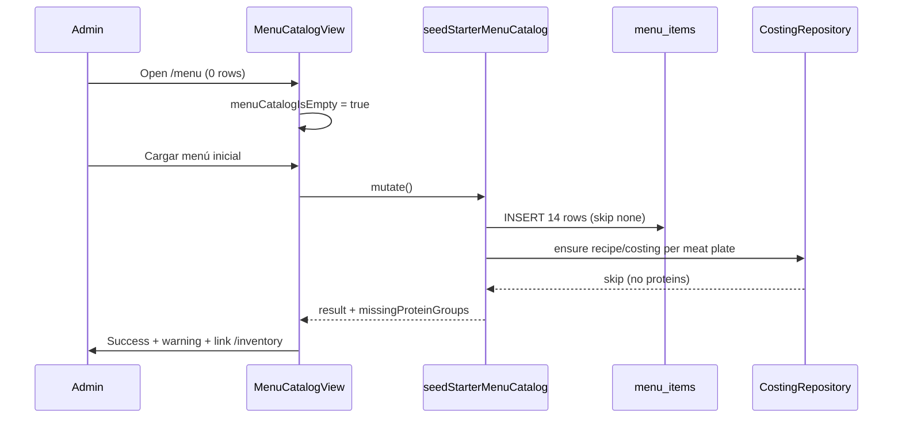

# Design — Menu Starter Catalog

## Overview

```
(app)/menu/page.tsx
  → menu/presentation/MenuCatalogView.tsx
    → useMenuCatalog (activeOnly: false for empty detection)
    → useSeedStarterMenuCatalog (mutation)
      → seedStarterMenuCatalogAction (server)
        → seedStarterMenuCatalog (application)
          → MenuItemRepository.createMany (new)
          → CostingRepository.ensureInferredRecipeIngredient (existing)
          → CostingRepository.ensureDefaultWastePctIfMissing (new port method)
        → invalidateMenuConsumers
```

Cross-context orchestration stays in **menu application** with **ports** defined in waste domain (`CostingRepository`), implemented in `waste/infrastructure/supabase-costing-repo.ts`.

## User flows

### Flow A — Empty catalog, no inventory (menu-only)



### Flow B — Empty catalog, proteins present (full starter)

1. Admin already ran inventory starter (Carne, Cochino, Pollo as active kg items).
2. Same as Flow A; `ensureInferredRecipeIngredient` inserts 9 recipe rows; `ensureDefaultWastePctIfMissing` inserts 9 costing rows.
3. Invalidate caches; table replaces empty card.
4. Manual L3: `/orders` lists plates; `/waste` shows configured merma defaults.

### Flow C — Catalog not empty

- Any `menu_items` row exists → no dashed starter card (FR-2).
- Admin uses **Nuevo ítem** or deactivate/reactivate flows from menu-items-crud.

## Domain model

### Starter constant (`menu/domain/starter-catalog.ts`)

```typescript
export type StarterMenuItemDefinition = {
  name: string;
  itemKind: MenuItemKind;
  proteinGroup: ProteinGroup | null;
  weightLabel: string | null;
  price: number;
};

export const STARTER_MENU_ITEMS: readonly StarterMenuItemDefinition[];
export function normalizeMenuItemName(name: string): string;
```

**SQL parity (14 rows):**

| name | item_kind | protein_group | weight_label | price |
|------|-----------|---------------|--------------|-------|
| Beef 1 kg | meat_plate | beef | 1kg | 44.00 |
| Beef 1/2 kg | meat_plate | beef | 500g | 24.00 |
| Beef 1/4 kg | meat_plate | beef | 250g | 13.00 |
| Pork belly 1 kg | meat_plate | pork | 1kg | 42.00 |
| Pork belly 1/2 kg | meat_plate | pork | 500g | 23.00 |
| Pork belly 1/4 kg | meat_plate | pork | 250g | 12.00 |
| Chicken 1 kg | meat_plate | chicken | 1kg | 38.00 |
| Chicken 1/2 kg | meat_plate | chicken | 500g | 21.00 |
| Chicken 1/4 kg | meat_plate | chicken | 250g | 11.00 |
| Nestea | drink | null | null | 3.50 |
| Coca-Cola | drink | null | null | 1.30 |
| Yuca | side | null | null | 0.00 |
| Arepa | side | null | null | 0.00 |
| Shredded salad | side | null | null | 0.00 |

Optional pure helper (menu or waste domain):

```typescript
export function defaultWastePctForProteinGroup(
  proteinGroup: ProteinGroup,
): number; // 30 | 25 | 20
```

### Use case algorithm (`seedStarterMenuCatalog`)

1. `assertAdmin(profile)`.
2. `existing ← menuRepo.listByMerchant(merchantId, { activeOnly: false })`.
3. Build `existingNames` Set via `normalizeMenuItemName`.
4. `toCreate ← STARTER_MENU_ITEMS` filtered not in set.
5. `inserted ← menuRepo.createMany(toCreate mapped with merchantId, isActive: true)`.
6. For each item in `inserted` where `itemKind === 'meat_plate'`:
   - `await costingRepo.ensureInferredRecipeIngredient({ merchantId, menuItemId, proteinGroup, weightLabel })`.
   - If recipe still missing (infer returned null / no row), increment `recipesSkippedCount` and track `proteinGroup`.
   - Else `await costingRepo.ensureDefaultWastePctIfMissing({ merchantId, menuItemId, proteinGroup })`.
7. Return aggregate result.

**Note:** `ensureInferredRecipeIngredient` today uses active inventory list without UoM filter. Implementer should extend `fetchProteinInventoryMaterials` (or inference helper) to require `unit_of_measure = 'kilogram'` for starter attach consistency with waste FR-6.

### Ports and repositories

**Extend `MenuItemRepository`:**

```typescript
createMany(inputs: CreateMenuItemPayload[]): Promise<MenuItem[]>;
```

Batch insert with `.insert([...]).select(...)`; map unique violation to domain error if partial overlap races occur.

**Extend `CostingRepository`:**

```typescript
ensureDefaultWastePctIfMissing(params: {
  merchantId: string;
  menuItemId: string;
  proteinGroup: ProteinGroup;
}): Promise<boolean>; // true if inserted
```

Implementation: SELECT existing `menu_item_costing` by `menu_item_id`; if absent INSERT default from `defaultWastePctForProteinGroup`.

Reuse existing `ensureInferredRecipeIngredient` (already idempotent on recipe row).

### Protein detection for UI callout

Before seed (or on empty state render), presentation may call a lightweight read:

- Option A: reuse `listProteinInventoryMaterials` via new read-only server action in waste infrastructure (admin-only).
- Option B: derive warning **only** from seed mutation result (`missingProteinGroups`) — simpler; pre-seed callout uses client-side optional query.

**Recommendation:** optional `useProteinInsumoAvailability(merchantId)` query returning `{ beef: boolean; pork: boolean; chicken: boolean }` based on active kg name match — enables proactive callout before click. If deferred, show generic copy + post-seed warning only (still AC-4 compliant).

## Data model (existing tables)

No migration required unless RLS gap found.

### `menu_items`

Insert columns: `merchant_id`, `name`, `item_kind`, `protein_group`, `weight_label`, `price`, `is_active`.

Partial unique index on active names (`idx_menu_items_merchant_name_active`) — inactive duplicates allowed; starter always creates active rows with seed-unique names.

### `recipe_ingredients`

Insert: `menu_item_id`, `raw_material_id`, `quantity_kg`.

Idempotent guard: no second row per `menu_item_id` (MVP v1 single primary ingredient).

### `menu_item_costing`

Insert: `merchant_id`, `menu_item_id`, `waste_pct`.

Idempotent guard: skip when row exists (preserve admin edits).

### Linking model

Menu seed and inventory seed share **no UUID**. Linking is **tenant + normalized protein name** at recipe attach time — same as `waste_cost_calculator.sql`.

## UI design (DESIGN.md)

### Empty state layout

Mirror `InventoryView` empty card:

| Element | Tailwind / component |
|---------|----------------------|
| Container | `rounded-lg border border-dashed border-border p-8 text-center` |
| Title | `text-sm text-muted-foreground` |
| Helper | `text-xs text-muted-foreground max-w-md mx-auto mt-2` |
| Actions | `mt-4 flex flex-col sm:flex-row gap-3 justify-center` |
| Primary | shadcn `Button` — **Nuevo ítem** |
| Secondary | `Button variant="outline"` — starter load |

Optional warning callout below card or inside card:

- `text-xs text-muted-foreground` or subtle border-left info strip (no heavy shadows).
- `Link` from `next/link` to `/inventory` with Flame Red / primary underline on hover.

Keep page header **Menú de venta** + **Nuevo ítem** in header row (inventory keeps header button too).

### Loading / error

- Mutation pending disables starter button; label *Cargando menú…*.
- Error: `role="alert"` destructive text, generic Spanish message from action failure.

### Accessibility

- `role="status"` on success summary.
- Starter button `type="button"`.
- Focus ring per DESIGN.md (Flame Red).

## Infrastructure touchpoints

| File | Change |
|------|--------|
| `menu/domain/starter-catalog.ts` | New constant + tests |
| `menu/domain/repository.ts` | `createMany` |
| `menu/infrastructure/supabase-menu-repo.ts` | Batch insert |
| `menu/application/use-cases.ts` | `seedStarterMenuCatalog` |
| `menu/application/use-cases.test.ts` | Seed matrix tests |
| `menu/infrastructure/menu-item-actions.ts` | `seedStarterMenuCatalogAction` |
| `menu/infrastructure/query-adapters.ts` | `useSeedStarterMenuCatalog`, wire invalidation |
| `menu/presentation/MenuCatalogView.tsx` | Empty state UX |
| `waste/domain/repository.ts` | `ensureDefaultWastePctIfMissing` |
| `waste/infrastructure/supabase-costing-repo.ts` | Implement + optional kg filter on protein fetch |

No changes to `src/app/(app)/menu/page.tsx` unless re-export requires it (likely unchanged — view-only).

## Performance budgets

| Surface | Budget |
|---------|--------|
| Empty-state extra query | One conditional `listByMerchant` (activeOnly: false) when detecting empty — same pattern as inventory |
| Seed mutation | ≤ 2 round-trips for menu batch + ≤ 18 sequential recipe/costing ensures (9 plates × 2) acceptable for rare admin action |
| `/menu` list after seed | ≤ 14 rows; no pagination |
| LCP | Unchanged table-only page; target < 2.5s mobile |

## Testing strategy

### Vitest (menu application)

Mock `MenuItemRepository` + `CostingRepository`:

- Inserts 14 when empty catalog
- Skips all when all names exist
- Non-admin throws `forbidden`
- Recipes attached when mock materials allow inference
- Partial proteins scenario
- No recipe calls for drink/side inserts

### Vitest (starter-catalog.ts)

- Length 14
- Unique normalized names
- Optional snapshot of name list vs SQL

### Manual

- L2: empty UI, success path, warning path
- L3: waiter `/orders` catalog; admin `/waste` rows
- L4: RLS cross-tenant

## Risks and mitigations

| Risk | Mitigation |
|------|------------|
| Cross-domain coupling | Depend only on waste **domain port** + pure helpers |
| Overwriting admin `waste_pct` | `ensureDefaultWastePctIfMissing` inserts only when absent |
| Protein exists as `unit` not `kg` | UoM filter during inference; treat as missing |
| Race: two admins seed concurrently | DB unique constraints + idempotent skips; show generic error on 23505 |
