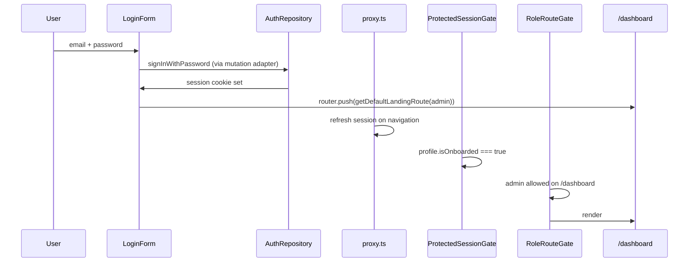

# Design — Multi-Tenant Authentication & Session Safeguards

## Overview

```
/login (exists, refactor)  →  Supabase Auth session cookie
       ↓
proxy.ts (session refresh, unauthenticated → /login)
       ↓
(auth)/onboarding  — if no public.users row (merchant-onboarding, unchanged)
       ↓
(app)/layout chain:
  ProtectedSessionGate → SessionProvider → SidebarProvider → AppSidebar + SidebarInset → page
       ↓
Role-appropriate routes (/dashboard | /orders | /kitchen | …)
       ↓
/dashboard (admin) → Create staff user panel → server action → admin Auth + RPC
```

This feature completes the **auth hexagonal extraction for login**, adds **RBAC gates** and **tenant context**, introduces a **`/kitchen` stub**, delivers **admin staff provisioning**, and ships a **mobile-first authenticated app shell** with shadcn Sidebar and role-filtered navigation. It does not redesign merchant onboarding or open general INSERT on `public.users`.

## Stack references (source-driven)

| Topic | Authority |
|-------|-----------|
| Next.js request interception | **`proxy.ts`** at repo root — `middleware.ts` is deprecated in Next.js 16 (`node_modules/next/dist/docs/01-app/03-api-reference/03-file-conventions/proxy.md`) |
| Supabase SSR session | `@supabase/ssr` `createServerClient` + `getClaims()` in proxy; `createClient` from `@/shared/infrastructure/supabase/server` in Server Components |
| Supabase Admin Auth | `auth.admin.createUser` via service-role client in `src/shared/infrastructure/supabase/admin.ts` — **server-only**, never `NEXT_PUBLIC_*` |
| App Router guards | Server Component `redirect()` from `next/navigation` |
| Hexagonal layout | [docs/architecture.md](../../docs/architecture.md) |

**Detected versions:** `next`: latest (proxy convention), `@supabase/ssr`: latest, Next 15+ App Router under `src/app/`.

## User flows

### Flow A — Admin login (onboarded)



### Flow B — Grill master blocked from dashboard

1. Onboarded user with `role = 'grill_master'` navigates to `/dashboard`.
2. `ProtectedSessionGate` passes (onboarded).
3. `RoleRouteGate` calls `resolveRoleRedirect('grill_master', '/dashboard')` → `/kitchen`.
4. Server `redirect('/kitchen')`.
5. Stub kitchen page renders.

Grill master **may** access `/inventory`, `/orders`, `/waste`, and `/kitchen` per approved matrix.

### Flow C — Waiter login

1. Sign-in succeeds.
2. Client navigates to `/orders` (or another route with one-hop RBAC redirect).
3. Waiter allowed on `/orders` only; blocked from `/dashboard`, `/inventory`, `/waste`, `/kitchen` → `/orders`.

### Flow D — Incomplete onboarding (unchanged)

1. User signs in without `public.users` row.
2. Client may push `/dashboard`.
3. `ProtectedSessionGate` reads profile → `isOnboarded === false` → `redirect('/onboarding')`.
4. Proxy never queried `public.users`.

### Flow E — Unauthenticated access

1. Request to `/inventory` without session.
2. `proxy.ts` `getClaims()` → no user → `redirect('/login')`.
3. `(app)` layout never runs.

### Flow F — Admin creates staff user

```mermaid
sequenceDiagram
  participant A as Admin (dashboard)
  participant F as CreateStaffUserForm
  participant M as useCreateStaffUser
  participant SA as Server action
  participant UC as createStaffUser use case
  participant Admin as admin.ts (service role)
  participant RPC as create_staff_user_profile
  participant Auth as Supabase Auth

  A->>F: email, password, fullName, role
  F->>M: mutate(input)
  M->>SA: invoke (no merchantId in payload)
  SA->>UC: createStaffUser(input, actorProfile, repo)
  UC->>UC: reject if actor.role !== admin
  UC->>Admin: auth.admin.createUser(email, password, email_confirm)
  Admin->>Auth: new Auth UID
  UC->>RPC: create_staff_user_profile(uid, email, fullName, role)
  RPC->>RPC: verify auth.uid() is admin; bind merchant_id from admin row
  RPC-->>UC: success
  UC-->>M: { userId, email, role }
  M-->>F: success toast / form reset
```

**Compensating action:** If RPC fails after Auth user creation, infrastructure deletes the orphan Auth user via `auth.admin.deleteUser` and maps to a generic domain error (no stack/service-role leakage).

**Never:** expose `SUPABASE_SERVICE_ROLE_KEY` to browser, `'use client'` modules, or presentation.

## Routing and guards

### Route groups

| Group | URLs | Auth | Onboarded | RBAC |
|-------|------|------|-----------|------|
| `(auth)` public | `/login`, `/register` | Optional | No | No |
| `(auth)` onboarding | `/onboarding` | Required | Must be **false** | No |
| `(auth)` recovery | `/auth/*` | Varies | No | No |
| `(app)` | `/dashboard`, `/inventory`, `/orders`, `/waste`, `/kitchen` | Required | Must be **true** | Yes |

### Guard stack (implementation target)

**1. `proxy.ts` (root) + `updateSession()`**

Current behavior preserved and documented:

```typescript
// proxy.ts — delegates to shared helper
export async function proxy(request: NextRequest) {
  return await updateSession(request);
}
```

`updateSession` (`src/shared/infrastructure/supabase/proxy.ts`):

- Creates per-request Supabase server client with cookie bridge.
- Calls `supabase.auth.getClaims()` (required for SSR session stability).
- Redirects to `/login` when no user and path is not public exception.
- **Does not** fetch `public.users` or enforce RBAC.

Public exceptions (current): `/`, `/login`, `/register`, `/auth/*`, `/instruments`. **`/onboarding` is not public.**

Optional hardening: redirect authenticated users away from `/login` to role default — UX only, not required for AC.

**2. `ProtectedSessionGate` (existing Server Component)**

```typescript
if (!profile) redirect('/login');
if (!profile.isOnboarded) redirect('/onboarding');
```

**3. `RoleRouteGate` (new Server Component)**

```typescript
const profile = await requireServerSessionProfile(); // onboarded guaranteed
const target = resolveRoleRedirect(profile.role, pathname);
if (target) redirect(target);
return children;
```

Recommended: nested per-route layouts keep pathname logic declarative and testable:

```
(app)/
  layout.tsx            → ProtectedSessionGate → SessionProvider → SidebarProvider shell
  dashboard/layout.tsx  → RoleRouteGate roles={['admin']}
  inventory/layout.tsx  → RoleRouteGate roles={['admin', 'grill_master']}
  orders/layout.tsx     → RoleRouteGate roles={['admin', 'grill_master', 'waiter']}
  waste/layout.tsx      → RoleRouteGate roles={['admin', 'grill_master']}
  kitchen/layout.tsx    → RoleRouteGate roles={['admin', 'grill_master']}
```

**4. `SessionProvider` (client)**

Mounted in `(app)/layout` inside gates, **before** `SidebarProvider`. Consumes `useSessionProfile()`:

```typescript
export type SessionContextValue = {
  userId: string;
  email: string;
  merchantId: string;
  merchantName: string | null;
  fullName: string | null;
  role: UserRole;
  isLoading: boolean;
  isError: boolean;
};
```

Only render provider when profile is onboarded (gates already ensured). Throw or redirect if query fails after gate (edge case).

**5. App shell (client + layout composition)**

After gates and `SessionProvider`, `(app)/layout.tsx` mounts:

```tsx
<SidebarProvider>
  <AppSidebar />           {/* auth/presentation — role-aware nav */}
  <SidebarInset>
    <AppShellHeader />     {/* SidebarTrigger + optional page title slot */}
    {children}
  </SidebarInset>
</SidebarProvider>
```

- **`AppSidebar`** (`src/domains/auth/presentation/components/app-sidebar.tsx`): consumes `useSession()` from `SessionProvider`; calls domain `getNavRoutesForRole(role)`; maps routes to Spanish labels; admin-only “Personal” item links to `/dashboard#personal`.
- **Sidebar primitive** (`src/shared/presentation/ui/sidebar.tsx`): shadcn CLI output — shared presentation only; no RBAC logic.
- **Mobile:** `collapsible="offcanvas"`; `SidebarTrigger` in compact top bar; overlay close on navigate via `useSidebar().setOpenMobile(false)`.
- **Desktop:** `collapsible="icon"` optional; must stay flat per DESIGN.md.

## Domain model (`src/domains/auth/`)

### Entities (extend existing)

```typescript
// domain/entities.ts — existing + new
export type UserRole = "admin" | "grill_master" | "waiter";

export type SessionProfile = {
  userId: string;
  email: string;
  merchantId: string | null;
  fullName: string | null;
  role: UserRole | null;
  isOnboarded: boolean;
};

export type SignInCredentials = {
  email: string;
  password: string;
};

export type SignInResult = {
  userId: string;
  email: string;
};

export type CreateStaffUserInput = {
  email: string;
  password: string;
  fullName: string;
  role: UserRole;
};

export type CreateStaffUserResult = {
  userId: string;
  email: string;
  role: UserRole;
};
```

### Role display labels (FR-15)

```typescript
// domain/role-labels.ts or presentation constant
export const ROLE_LABELS: Record<UserRole, string> = {
  admin: "Administrador",
  grill_master: "Parrillero",
  waiter: "Mesero",
};
```

UI shows **“Parrillero”** for `grill_master`; DB and TypeScript keep `grill_master`.

### RBAC pure functions (new — `domain/rbac.ts`)

```typescript
export type AppRoute =
  | "/dashboard"
  | "/inventory"
  | "/orders"
  | "/waste"
  | "/kitchen";

export function getDefaultLandingRoute(role: UserRole): AppRoute;

export function isRouteAllowed(role: UserRole, pathname: string): boolean;

/** Returns redirect target pathname or null if allowed */
export function resolveRoleRedirect(
  role: UserRole,
  pathname: string,
): AppRoute | null;

/** Ordered MVP routes for nav derivation — single source with isRouteAllowed */
export const APP_NAV_ROUTES: readonly AppRoute[] = [
  "/dashboard",
  "/inventory",
  "/orders",
  "/waste",
  "/kitchen",
] as const;

/** Routes visible in sidebar for role; presentation adds labels and admin-only Personal anchor */
export function getNavRoutesForRole(role: UserRole): AppRoute[];
```

Presentation **must not** maintain a parallel allow/deny matrix. Optional admin-only nav entry “Personal” (`/dashboard#personal`) is added in `AppSidebar` when `role === 'admin'` — not part of `AppRoute` enum; RBAC for the destination remains `/dashboard` (admin only).

**Approved RBAC matrix (locked — OQ-3/OQ-4 closed):**

| Route | admin | grill_master | waiter |
|-------|-------|--------------|--------|
| `/dashboard` | ✓ | ✗ → `/kitchen` | ✗ → `/orders` |
| `/inventory` | ✓ | ✓ | ✗ → `/orders` |
| `/orders` | ✓ | ✓ | ✓ |
| `/waste` | ✓ | ✓ | ✗ → `/orders` |
| `/kitchen` | ✓ | ✓ | ✗ → `/orders` |

**Default landings:** `admin` → `/dashboard`, `grill_master` → `/kitchen`, `waiter` → `/orders`.

Prefix matching: `/orders/123` inherits `/orders` policy.

All functions are pure — **Vitest required**.

### Validations (`domain/validations.ts`)

Replace placeholder with:

- `signInCredentialsSchema` (Zod) + `parseSignInCredentials`
- `createStaffUserInputSchema` (Zod) + `parseCreateStaffUserInput`:
  - Email: trimmed, valid format, max 255
  - Password: min 6, max 72
  - Full name: trimmed, non-empty, max 255
  - Role: `user_role` enum values

### Ports

**Existing — `SessionProfileRepository`:**

```typescript
export interface SessionProfileRepository {
  getByUserId(userId: string, email: string): Promise<SessionProfile>;
}
```

**New — `AuthRepository`:**

```typescript
export interface AuthRepository {
  signInWithPassword(credentials: SignInCredentials): Promise<SignInResult>;
  signOut(): Promise<void>;
}
```

**New — `StaffUserRepository`:**

```typescript
export interface StaffUserRepository {
  createStaffUser(
    input: CreateStaffUserInput,
    actorMerchantId: string,
  ): Promise<CreateStaffUserResult>;
}
```

`actorMerchantId` is always supplied by the use case from `actorProfile.merchantId` — **never** from client input.

### Use cases (`application/use-cases.ts`)

| Function | Responsibility |
|----------|----------------|
| `getSessionProfile` | Existing — delegate to repo |
| `signIn(credentials, authRepo)` | Validate → `authRepo.signInWithPassword` |
| `signOut(authRepo)` | Delegate sign-out |
| `createStaffUser(input, actorProfile, repo)` | Reject non-admin or null `merchantId`; validate input; delegate with `actorProfile.merchantId` |

## Infrastructure

### `createAuthRepository(supabase)` (new)

- `signInWithPassword`: calls `supabase.auth.signInWithPassword`, maps errors to domain error type (no raw Supabase messages to UI).
- `signOut`: `supabase.auth.signOut()`.

Lives in `infrastructure/supabase-auth-repo.ts` (prefer separate file for SRP).

### `createStaffUserRepository(adminClient, userClient)` (new)

Server-only implementation in `infrastructure/supabase-staff-repo.ts`:

1. **Step A:** `adminClient.auth.admin.createUser({ email, password, email_confirm: true })` → Auth UID.
2. **Step B:** Call `userClient.rpc('create_staff_user_profile', { p_user_id, p_email, p_full_name, p_role })` using the **admin actor's session client** (not service role for RPC — RPC validates `auth.uid()`).
3. On RPC failure: `adminClient.auth.admin.deleteUser(uid)` compensating cleanup.

Uses:

- `createAdminClient()` from `src/shared/infrastructure/supabase/admin.ts` — reads `SUPABASE_SERVICE_ROLE_KEY` from server env only.
- Standard server `createClient()` for RPC call authenticated as the admin.

### Session profile repo (existing)

`createSessionProfileRepository` — unchanged mapping from `users` table:

| DB column | Domain field |
|-----------|--------------|
| `id` | `userId` |
| `merchant_id` | `merchantId` |
| `email` | `email` |
| `full_name` | `fullName` |
| `role` | `role` |

### Query adapters (`infrastructure/query-adapters.ts`)

| Hook | Purpose |
|------|---------|
| `useSessionProfile()` | Fix query key to `sessionProfileQueryKey(userId)` |
| `useSignIn()` | Mutation → `signIn` use case → invalidate session profile on success |
| `useSignOut()` | Optional if logout refactored |
| `useCreateStaffUser()` | Mutation → server action → `createStaffUser` use case |

Client hooks create browser Supabase client **only inside infrastructure**, not presentation. **Create-user mutation must call a server action** — never instantiate admin client in client code.

### Server helpers (existing + extend)

| Helper | Use |
|--------|-----|
| `getServerSessionProfile()` | Gates, layouts |
| `requireServerSessionProfile()` | Throws redirect if missing |
| `createStaffUserAction(input)` | Thin server action wrapper; loads actor profile; calls use case |

### Admin Supabase client (`src/shared/infrastructure/supabase/admin.ts`)

```typescript
// Server-only — import guard: never in 'use client' or presentation
export function createAdminClient(): SupabaseClient {
  // SUPABASE_SERVICE_ROLE_KEY + SUPABASE_URL from process.env
}
```

**Never** prefix service role with `NEXT_PUBLIC_`. **Never** import in presentation or `src/app/` page components directly — only infrastructure server modules and server actions.

## Data model

### Existing schema (reuse `users`)

From `supabase/migrations/20260825204800_initial_schema_and_onboarding.sql`:

```sql
CREATE TYPE user_role AS ENUM ('admin', 'grill_master', 'waiter');

CREATE TABLE users (
    id UUID PRIMARY KEY,
    merchant_id UUID NOT NULL REFERENCES merchants(id) ON DELETE CASCADE,
    email VARCHAR(255) NOT NULL UNIQUE,
    full_name VARCHAR(255) NOT NULL,
    role user_role NOT NULL DEFAULT 'waiter',
    created_at TIMESTAMPTZ NOT NULL DEFAULT NOW()
);
```

- `users.id` = `auth.uid()`.
- RLS tenant fence via `get_user_merchant_id()` — already on operational tables.
- **Role-specific mutation RLS** remains a **later spec** (OQ-9 closed). Route guards only in this feature.

### Focused migration — `create_staff_user_profile` RPC

**New migration:** `supabase/migrations/<timestamp>_create_staff_user_profile.sql` (focused — do not redesign onboarding).

Per Supabase security checklist (`.agents/skills/supabase/SKILL.md`):

- `SECURITY DEFINER` with `SET search_path = public`
- Explicit `auth.uid()` check: caller must exist in `public.users` with `role = 'admin'`
- Derive `merchant_id` from admin's row — **never** accept `merchant_id` from RPC parameters
- Verify `p_user_id` exists in `auth.users` and has no existing `public.users` row
- `REVOKE ALL ... FROM PUBLIC`; `GRANT EXECUTE ... TO authenticated` only
- Run `supabase db advisors` after applying

**Spec-level RPC contract (implementer writes SQL):**

```sql
CREATE OR REPLACE FUNCTION public.create_staff_user_profile(
  p_user_id uuid,
  p_email text,
  p_full_name text,
  p_role user_role
)
RETURNS uuid
LANGUAGE plpgsql
SECURITY DEFINER
SET search_path = public
AS $$
DECLARE
  v_admin_id uuid := auth.uid();
  v_merchant_id uuid;
BEGIN
  -- 1. Caller authenticated
  -- 2. Caller is admin with merchant_id
  -- 3. p_user_id exists in auth.users, no public.users row yet
  -- 4. INSERT public.users (id, merchant_id, email, full_name, role)
  -- 5. RETURN p_user_id
END;
$$;

REVOKE ALL ON FUNCTION public.create_staff_user_profile(uuid, text, text, user_role) FROM PUBLIC;
GRANT EXECUTE ON FUNCTION public.create_staff_user_profile(uuid, text, text, user_role) TO authenticated;
```

Regenerate types: `pnpm supabase gen types` → `src/shared/infrastructure/database/supabase.types.ts`.

### Test users (manual verification)

**Product path:** admin creates staff via dashboard UI (OQ-10 closed). SQL/Studio insert is **emergency dev fallback only** — document in progress journal, not acceptance criteria.

## UI design — login

Follow [DESIGN.md](../../DESIGN.md). Onboarding spec deferred login restyle; **this feature owns login**.

### Login form targets

| Element | Spec |
|---------|------|
| Card | `border border-border`, `rounded-lg`, bg `card`, **no** shadow-xl |
| Title | section_title scale (~28px, weight 600) |
| Primary button | shadcn `Button` default variant (Flame Red) |
| Inputs | shadcn `Input` + `Label`, `rounded-md` |
| Error | `<p role="alert" className="text-sm text-destructive">` |
| Focus | `ring-primary` |

### Remove antipatterns

Current `login-form.tsx` uses `shadow-xl shadow-primary/5` — **remove** per DESIGN.md antipatterns.

### Page shell

`(auth)/login/page.tsx` split layout may remain; ensure right panel background uses `bg-background` token.

## UI design — admin create-user panel

Mounted on `/dashboard` — **admin-only** (server gate hides section for non-admin; use case rejects others).

Follow [DESIGN.md](../../DESIGN.md) flat card pattern:

| Element | Spec |
|---------|------|
| Section card | `border border-border`, `rounded-lg`, bg `card`, no heavy shadow |
| Title | e.g. "Crear usuario del personal" (weight 600) |
| Fields | Email, password, full name, role `<Select>` |
| Role options | `ROLE_LABELS`: Administrador, Parrillero, Mesero — values remain enum snake_case |
| Submit | Flame Red primary button |
| Success | Generic Spanish confirmation; reset form |
| Error | `role="alert"`, generic message — no credential or service-role leakage |

Component: `src/domains/auth/presentation/components/create-staff-user-form.tsx` — consumes `useCreateStaffUser()` only.

### Kitchen stub copy (Spanish)

| Element | Copy |
|---------|------|
| Title | Cola de cocina |
| Body | La vista de pedidos activos estará disponible pronto. |
| Back link (optional) | Volver — admin only via nav |

Minimal placeholder — no queue components.

## UI design — authenticated app shell / sidebar

Mobile-first shell for all `(app)` routes. Auth routes stay sidebar-free.

### Install (implementer)

```bash
pnpm dlx shadcn@latest add sidebar
```

Target path via `components.json`: `@/shared/presentation/ui`. Accept any peer primitives the CLI adds (Sheet, Separator, Tooltip, etc.) into the same folder.

**Reference:** [shadcn Sidebar (Base UI)](https://ui.shadcn.com/docs/components/base/sidebar)

### Hexagonal file placement

| Path | Layer | Role |
|------|-------|------|
| `src/shared/presentation/ui/sidebar.tsx` | Shared presentation | shadcn primitive (CLI) |
| `src/shared/presentation/ui/sheet.tsx` (if CLI adds) | Shared presentation | Mobile overlay peer |
| `src/domains/auth/presentation/components/app-sidebar.tsx` | Auth presentation | Role-filtered nav, header, footer |
| `src/domains/auth/presentation/components/app-shell-header.tsx` | Auth presentation | Mobile `SidebarTrigger` + compact top bar |
| `src/app/(app)/layout.tsx` | App route | Gates → SessionProvider → SidebarProvider shell |
| `src/app/globals.css` | Global tokens | `--sidebar-*` mapped to DESIGN.md |

### Composition

```
SidebarProvider (defaultOpen per shadcn; mobile uses offcanvas)
├── Sidebar [collapsible="offcanvas" on mobile / "icon" on md+]
│   ├── SidebarHeader — merchant name (+ optional AsaderoLogo)
│   ├── SidebarContent — SidebarGroup → SidebarMenu → SidebarMenuItem / SidebarMenuButton
│   └── SidebarFooter — fullName, ROLE_LABELS[role], LogoutButton (FR-12)
└── SidebarInset [min-h-svh]
    ├── AppShellHeader — SidebarTrigger (≥44px), safe-area padding
    └── {children} — route pages
```

### Nav item table (Spanish labels — presentation)

Derived from `getNavRoutesForRole(role)` + admin-only Personal row:

| Role | Items (order) | Href |
|------|---------------|------|
| `admin` | Panel, Inventario, Pedidos, Merma, Cocina, Personal | `/dashboard`, `/inventory`, `/orders`, `/waste`, `/kitchen`, `/dashboard#personal` |
| `grill_master` | Cocina, Inventario, Pedidos, Merma | `/kitchen`, `/inventory`, `/orders`, `/waste` |
| `waiter` | Pedidos | `/orders` |

Waiter sidebar is intentionally minimal — only Pedidos in nav plus footer user/sign-out.

**Active state:** `SidebarMenuButton` with `isActive={pathname.startsWith(href)}` (strip hash for `/dashboard#personal` → active when on `/dashboard`).

**On navigate (mobile):** call `setOpenMobile(false)` in link `onClick` or use shadcn pattern from docs.

### `--sidebar-*` token mapping (`globals.css`)

Map to DESIGN.md — not default shadcn gray demo:

| CSS variable | Maps to |
|--------------|---------|
| `--sidebar-background` | Light: `#ffffff` (card_pearl); dark: `#18181b` (card_tile_1) |
| `--sidebar-foreground` | `--foreground` |
| `--sidebar-primary` | `#e11d48` (Flame Red) |
| `--sidebar-primary-foreground` | `#ffffff` |
| `--sidebar-accent` | `rgba(225, 29, 72, 0.1)` (primary_translucent) for soft active bg |
| `--sidebar-accent-foreground` | `--foreground` |
| `--sidebar-border` | `--border` (hairline) |
| `--sidebar-ring` | `--ring` → primary |

No `shadow-lg` / `shadow-xl` on sidebar. Font weights 300 / 400 / 600 / 700 only.

### Mobile-first behavior

| Concern | Spec |
|---------|------|
| Viewport | ~375px one-handed use |
| Collapse | `offcanvas` — overlay/sheet owned by shadcn Sidebar |
| Top bar | `SidebarTrigger` in `AppShellHeader`; not hover-only |
| Touch targets | `min-h-11 min-w-11` (44px) on trigger and menu buttons |
| Height | `min-h-svh` on shell; `pt-safe` / env safe-area on top bar if needed |
| Content | `SidebarInset` full width on mobile when sidebar closed |
| Keyboard | `cmd/ctrl+b` optional; not required for AC |

### Remove starter chrome

Current `(app)/layout.tsx` includes DeployButton, generic Next.js nav, AuthButton, Supabase footer — **remove** as part of shell task. Sign-out moves to `SidebarFooter` via existing logout component/adapter (FR-12).

### Merchant header

Display `merchants.name` for session `merchantId`. Prefer extending session profile read with join:

```sql
-- illustrative; implementer adds to session profile query
SELECT u.*, m.name AS merchant_name FROM users u JOIN merchants m ON m.id = u.merchant_id WHERE u.id = auth.uid()
```

Expose as `merchantName` on `SessionProfile` / `SessionProvider`.

## Performance budgets

| Metric | Budget | Notes |
|--------|--------|-------|
| Login LCP | < 2.5s | No dynamic chart imports |
| CLS | < 0.1 | Fixed form width |
| Proxy | +0 DB queries | Session claims only |
| `(app)` gate | 1× `users` PK read | Reuse profile per request where Next cache allows |
| SessionProvider | 1 TanStack query | `staleTime: 60_000` suggested |
| Create-user mutation | 1× Auth admin + 1× RPC | No N+1 |
| App shell CLS | < 0.1 | Fixed sidebar trigger; no layout jump on mobile open |
| Sidebar JS | Minimal | shadcn Sidebar only; no second drawer library |

## App route files

| File | Action |
|------|--------|
| `src/app/(auth)/login/page.tsx` | Keep shell; ensure container uses DESIGN tokens |
| `src/app/(app)/layout.tsx` | Replace starter chrome with SidebarProvider shell + gates + SessionProvider |
| `src/app/globals.css` | Add `--sidebar-*` token overrides per DESIGN.md |
| `src/shared/presentation/ui/sidebar.tsx` | **Create** via shadcn CLI |
| `src/domains/auth/presentation/components/app-sidebar.tsx` | **Create** — role-filtered nav |
| `src/domains/auth/presentation/components/app-shell-header.tsx` | **Create** — mobile trigger bar |
| `src/app/(app)/kitchen/page.tsx` | **Create** stub |
| `src/app/(app)/dashboard/layout.tsx` | Nested `RoleRouteGate` — **admin only**; hosts create-user panel |
| `src/app/(app)/orders/layout.tsx` | Nested gate — **admin + grill_master + waiter** |
| `src/app/(app)/inventory/layout.tsx` | Nested gate — **admin + grill_master** |
| `src/app/(app)/waste/layout.tsx` | Nested gate — **admin + grill_master** |
| `src/app/(app)/kitchen/layout.tsx` | Nested gate — **admin + grill_master** |
| `proxy.ts` | No RBAC/profile changes |
| `src/shared/infrastructure/supabase/proxy.ts` | Session-only; document public path list |
| `src/shared/infrastructure/supabase/admin.ts` | **Create** server-only admin client |

## Error handling

| Source | UI behavior |
|--------|-------------|
| Invalid credentials | Generic Spanish: "Correo o contraseña incorrectos." |
| Domain validation | Field-level Spanish messages |
| Network / unknown | Generic retry message |
| RBAC deny | Silent redirect to role landing (no error toast) |
| Create-user failure | Generic Spanish: e.g. "No se pudo crear el usuario." |
| Logs | Error codes only; no email/password/service-role details |

## Deferred / follow-up

| Item | Reason |
|------|--------|
| Register / forgot-password hexagonal extraction | Out of scope; login sets pattern |
| Role-specific RLS mutations | Separate spec (OQ-9 closed — route guards only here) |
| Full kitchen queue UI | Feature 4 |
| Email invitation / magic-link staff onboarding | Out of scope — admin sets initial password (FR-14) |
| Staff listing, edit, deactivate, role change | Out of scope — create-only |
| Merchant self-signup / register restyle | merchant-onboarding / out of scope |

## File touch list (implementation reference)

| Path | Action |
|------|--------|
| `src/domains/auth/domain/rbac.ts` | Create + tests; add `getNavRoutesForRole`, `APP_NAV_ROUTES` |
| `src/domains/auth/domain/role-labels.ts` | Create `ROLE_LABELS` |
| `src/domains/auth/presentation/components/app-sidebar.tsx` | Create — RBAC nav, header, footer |
| `src/domains/auth/presentation/components/app-shell-header.tsx` | Create — SidebarTrigger top bar |
| `src/shared/presentation/ui/sidebar.tsx` | shadcn CLI install |
| `src/app/globals.css` | `--sidebar-*` DESIGN.md mapping |
| `src/domains/auth/domain/validations.ts` | Sign-in + create-staff Zod |
| `src/domains/auth/domain/repository.ts` | Add `AuthRepository`, `StaffUserRepository` |
| `src/domains/auth/domain/entities.ts` | Add `CreateStaffUserInput/Result` |
| `src/domains/auth/application/use-cases.ts` | Add `signIn`, `createStaffUser` |
| `src/domains/auth/infrastructure/supabase-auth-repo.ts` | Create |
| `src/domains/auth/infrastructure/supabase-staff-repo.ts` | Create (server-only) |
| `src/domains/auth/infrastructure/staff-user-action.ts` | Server action wrapper |
| `src/domains/auth/infrastructure/query-adapters.ts` | Add `useSignIn`, `useCreateStaffUser`, fix query key |
| `src/domains/auth/presentation/components/login-form.tsx` | Adapter + DESIGN.md |
| `src/domains/auth/presentation/components/create-staff-user-form.tsx` | Create |
| `src/domains/auth/presentation/components/role-route-gate.tsx` | Create |
| `src/domains/auth/presentation/providers/session-provider.tsx` | Create |
| `src/shared/infrastructure/supabase/admin.ts` | Create server-only admin client |
| `supabase/migrations/<timestamp>_create_staff_user_profile.sql` | Focused RPC migration |
| `src/app/(app)/kitchen/page.tsx` | Create stub |
| `src/app/(app)/dashboard/page.tsx` | Add create-user panel (admin) |
| `src/app/(app)/*/layout.tsx` | Per-route RBAC gates |
| `src/app/(app)/layout.tsx` | Sidebar shell; remove starter chrome |
| `src/domains/auth/presentation/components/onboarding-session-gate.tsx` | Use `getDefaultLandingRoute(role)` |

Presentation and `src/app/` **must not** add `@supabase/supabase-js` imports.
