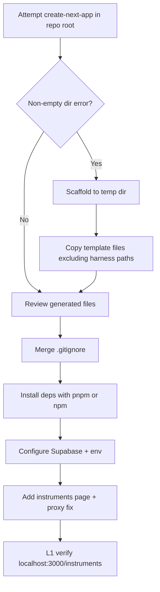

# Design — Next.js 15 + Supabase project bootstrap

## Overview

This feature bootstraps the official Supabase **with-supabase** Next.js template into the existing asadero-pro repository. It establishes connectivity and a single public read smoke route. Hexagonal domain structure is explicitly deferred.

## Layout decision

| Concern | This feature | Future MVP features |
|---------|--------------|---------------------|
| App routes | Root `app/` (template default) | Migrate to `src/app/(auth)` + `src/app/(app)` |
| Supabase clients | `lib/supabase/client.ts`, `lib/supabase/server.ts` | Shared factory under `src/shared/infrastructure/` |
| Data access in pages | Direct `createClient()` in Server Component (quickstart) | Query adapters + use cases |
| Database | Quickstart `instruments` table | `docs/database-schema.md` via migrations |
| Auth guard | Template proxy/middleware | `(app)` group + middleware redirect |

**Do not** create `src/domains/` or `src/app/` in this slice. One layout only.

## Target directory structure (after scaffold)

```
asadero-pro/
├── app/
│   ├── layout.tsx
│   ├── page.tsx
│   ├── globals.css
│   └── instruments/
│       └── page.tsx          # NEW — quickstart smoke page
├── lib/
│   └── supabase/
│       ├── client.ts         # Browser client
│       ├── server.ts         # Server Component client
│       └── proxy.ts          # MODIFIED — allow /instruments without auth
├── public/
├── AGENTS.md                 # PRESERVED — harness
├── docs/                     # PRESERVED
├── specs/                    # PRESERVED
├── progress/                 # PRESERVED
├── .cursor/                  # PRESERVED
├── .env.example              # From template (placeholders)
├── .env.local                # Local only — gitignored
├── package.json
├── next.config.ts            # Or .js/.mjs per template version
├── tsconfig.json
└── ...
```

Exact filenames may vary slightly with the current template version; implementer aligns with generated output.

## Scaffolding strategy (non-empty repo)



**Preserve list (never delete):** see FR-1 in `requirements.md`.

**Merge conflicts:** If template ships its own `README.md`, prefer keeping the harness-oriented root docs (`AGENTS.md` as entry point). Template README may be omitted or merged minimally — do not replace `AGENTS.md`.

## Supabase connectivity

### Cloud (preferred)

1. Human or implementer creates project at [database.new](https://database.new) or Supabase Dashboard.
2. Run instruments SQL in SQL Editor.
3. Copy **Project URL** and **publishable key** from Connect panel (Next.js tab).

### Local fallback (`docs/supabase.md`)

If cloud keys are unavailable:

```bash
pnpm dlx supabase init
pnpm dlx supabase start
```

Run equivalent SQL against local Postgres. Use local anon URL/key in `.env.local`. Document URLs from CLI output in progress journal.

### Environment variables

Official quickstart names (verified March 2026 docs):

| Variable | Purpose |
|----------|---------|
| `NEXT_PUBLIC_SUPABASE_URL` | Supabase project URL |
| `NEXT_PUBLIC_SUPABASE_PUBLISHABLE_KEY` | Client-safe publishable key (formerly anon key in older docs) |

Template `.env.example` is the source of truth if names differ at scaffold time.

## Auth / proxy behavior

The `with-supabase` template redirects unauthenticated users away from most routes. The quickstart requires exempting `/instruments`:

```typescript
// lib/supabase/proxy.ts — illustrative excerpt; match live template
if (
  request.nextUrl.pathname !== "/" &&
  !user &&
  !request.nextUrl.pathname.startsWith("/login") &&
  !request.nextUrl.pathname.startsWith("/auth") &&
  request.nextUrl.pathname !== "/instruments" &&
  !request.nextUrl.pathname.startsWith("/instruments/")
) {
  // redirect to login
}
```

Implementer copies the exact surrounding logic from the generated template file.

## Instruments page

`app/instruments/page.tsx` — Server Component pattern from official docs:

- Import `createClient` from `@/lib/supabase/server`.
- Async child component queries `supabase.from('instruments').select()`.
- Render `JSON.stringify(instruments, null, 2)` inside `<pre>` on success.
- Render error message on failure.
- Wrap async child in `<Suspense>` with loading fallback.

No TanStack Query, no domain types, no presentation layer abstraction for this slice.

## Data model (this slice only)

| Table | Columns | RLS |
|-------|---------|-----|
| `instruments` | `id bigint PK`, `name text` | Public `SELECT` for `anon` |

This table is **not** part of the BBQ domain. Do not reference it in future domain specs except as "remove or ignore during migration."

## Domain touchpoints

**None.** No ports, use cases, or repository interfaces in this feature.

## User flow

1. Developer runs `pnpm dev` (or `npm run dev`).
2. Opens `http://localhost:3000/instruments`.
3. Sees JSON list of instruments from Supabase.
4. Optional: visit `/` or `/login` to confirm template auth pages still exist.

No login required for the smoke path.

## Package manager

| Step | Preference |
|------|------------|
| Dependency install | `pnpm install` |
| Dev server | `pnpm dev` |
| Scaffold command | `npx create-next-app@latest` (npx is fine) |

If template generates `package-lock.json`, implementer chooses one:

- **Option A:** Delete `package-lock.json`, run `pnpm import` or fresh `pnpm install`, commit `pnpm-lock.yaml`.
- **Option B:** Keep npm for this slice only — document in progress journal (architecture prefers pnpm long-term).

## Optional: Supabase Agent Skills

Command: `npx skills add supabase/agent-skills`

Installs procedural Supabase guidance for AI agents. Does not affect runtime app behavior. Safe to skip.

## Performance budgets

Not applicable for this slice. Single Server Component fetch of three rows — no charts, no list virtualization, no client bundle concerns beyond the default template.

Future dashboard features will define LCP/CLS budgets in their specs.

## Security notes

- Only the publishable key belongs in `NEXT_PUBLIC_*` vars.
- Service role key must never appear in the Next.js app or git.
- RLS policy allows public read on `instruments` only — acceptable for demo data, not for BBQ operational data.

## Verification mapping

| Level | Action |
|-------|--------|
| L1 | Implementer: dev server + `/instruments` in browser |
| L2 | Walk AC-1 through AC-7 in requirements |
| L3 | N/A — no sibling MVP routes yet |
| L4 | N/A — no multi-tenant data |

## Follow-up features (not in this spec)

- Reconcile root `app/` → `src/app/` hexagonal layout
- Supabase migrations for BBQ schema
- Generated types workflow (`docs/supabase.md`)
- TanStack Query provider and domain query adapters
- Auth roles (`admin`, `grill_master`, `waiter`) and `(app)` route group
