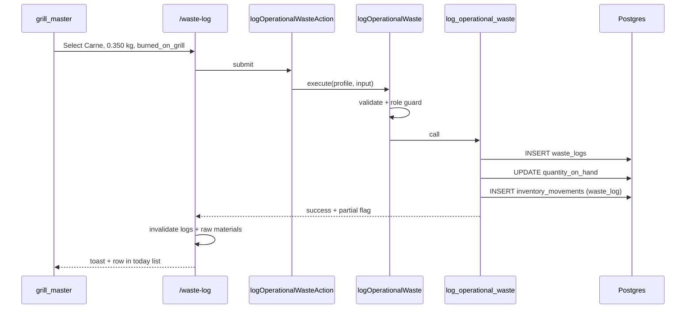

# Design — Operational Waste Logging

## Overview

```
(app)/waste-log/page.tsx          (view container — NOT under /waste layout)
  → presentation/OperationalWasteLogView.tsx
    → query-adapters (useLogOperationalWaste, useOperationalWasteLogsToday)
      → server actions (operational-waste-actions.ts)
        → application/logOperationalWaste, listOperationalWasteLogsForDay
          → domain: validateWasteLogInput, calculateWasteLogTotalCost
          → infrastructure/supabase-operational-waste-repo.ts
            → RPC log_operational_waste(...)
              → waste_logs INSERT + inventory UPDATE + inventory_movements INSERT
```

Extend **`src/domains/waste/`** — operational logging lives beside costing (`WasteCostingView`, `MeatPlateCostingTable` on `/waste`).

## Route and navigation

| Path | Layout gate | Sidebar label | Icon suggestion |
|------|-------------|-----------------|-----------------|
| `/waste` | `admin` only (existing) | **Merma y costos** | Trash2 (existing) |
| **`/waste-log`** | **`admin` \| `grill_master`** | **Registrar merma** | Scale or ClipboardList (distinct from costing) |

**Why not `/waste/log`:** `(app)/waste/layout.tsx` currently wraps all `/waste/*` children with admin-only `RoleRouteGate`. A nested log route would block `grill_master`. Use sibling **`/waste-log`** with its own `layout.tsx`.

**RBAC changes** ([src/domains/auth/domain/rbac.ts](../../src/domains/auth/domain/rbac.ts)):

- Add route literal `"/waste-log"`.
- `admin`: allow; include in nav after kitchen or near waste for admins only on costing link.
- `grill_master`: allow; add to nav (e.g. after **Cocina**).
- `waiter`: deny; redirect to `/orders`.

Update [app-sidebar.tsx](../../src/domains/auth/presentation/components/app-sidebar.tsx) route config map separately from `/waste`.

Optional: link from `KitchenQueueView` header (“Registrar merma”) → `/waste-log` for discoverability.

## User flows

### Flow A — Grill master logs overcooked arrachera



### Flow B — Admin reviews today’s logs

Same page: history section below form; admin may also use `/waste` for theoretical merma %—no navigation merge.

### Flow C — Waiter blocked

`RoleRouteGate` on `/waste-log` → redirect `/orders`; sidebar omits entry.

### Flow D — Cross-tenant attempt

Use case loads raw material by id scoped to merchant; RPC re-validates `merchant_id`; RLS rejects mismatch.

## Domain model

### Entities (new in `domain/entities.ts` or `domain/operational-waste.ts`)

```typescript
export type WasteReason =
  | "burned_on_grill"
  | "fat_discarded"
  | "spoiled_raw"
  | "customer_return";

export type OperationalWasteLogInput = {
  rawMaterialId: string;
  weightKg: number;
  reason: WasteReason;
};

export type OperationalWasteLog = {
  id: string;
  rawMaterialId: string;
  rawMaterialName: string;
  weightKg: number;
  unitCost: number;
  totalCost: number;
  reason: WasteReason;
  loggedByUserId: string | null;
  loggedByDisplayName: string | null;
  createdAt: string; // ISO
};
```

### Pure functions (`domain/operational-waste.ts`)

- `calculateWasteLogTotalCost(weightKg: number, unitCost: number): number`
- `validateOperationalWasteInput(input: OperationalWasteLogInput): Result` (Zod or existing validation style in [validations.ts](../../src/domains/waste/domain/validations.ts))
- `WASTE_REASON_LABELS_ES: Record<WasteReason, string>` for presentation mapping (domain or shared presentation helper—prefer domain constant for test stability)

### Port (`domain/repository.ts` extension)

```typescript
export interface OperationalWasteRepository {
  logWaste(params: {
    merchantId: string;
    actorUserId: string;
    actorRole: UserRole;
    input: OperationalWasteLogInput;
  }): Promise<{ log: OperationalWasteLog; partialStock: boolean }>;

  listLogsForLocalDay(params: {
    merchantId: string;
    timeZone: string;
    dayStartIso: string;
    dayEndIso: string;
    limit: number;
  }): Promise<OperationalWasteLog[]>;
}
```

### Application use cases

- **`logOperationalWaste`** — Assert role ∈ `{ admin, grill_master }`; validate input; delegate to repository; map RPC errors to domain errors (`InsufficientRole`, `RawMaterialNotFound`, `InvalidWasteInput`).
- **`listOperationalWasteLogsForDay`** — Compute calendar day bounds in application using locked timezone **`America/Caracas`** (IANA; Venezuela). Not rolling 24h. Inject as shared constant (e.g. `OPERATIONAL_WASTE_LOG_TIMEZONE`) until `merchants.timezone` exists; read-only for authorized roles.

## Database

### Existing: `waste_logs`

No column changes required. Enum reasons confirmed in migration `20260825204800_initial_schema_and_onboarding.sql`.

### Migration: `YYYYMMDDHHMMSS_operational_waste_logging.sql`

**1. Extend inventory movement types**

```sql
ALTER TABLE inventory_movements
  DROP CONSTRAINT IF EXISTS inventory_movements_movement_type_check;

ALTER TABLE inventory_movements
  ADD CONSTRAINT inventory_movements_movement_type_check
  CHECK (movement_type IN ('receipt', 'order_deduction', 'waste_log'));

ALTER TABLE inventory_movements
  DROP CONSTRAINT IF EXISTS inventory_movements_quantity_check;

ALTER TABLE inventory_movements
  ADD CONSTRAINT inventory_movements_quantity_check
  CHECK (
    (movement_type = 'receipt' AND quantity > 0)
    OR (movement_type = 'order_deduction' AND quantity >= 0)
    OR (movement_type = 'waste_log' AND quantity > 0)
  );

ALTER TABLE inventory_movements
  ADD COLUMN IF NOT EXISTS waste_log_id UUID NULL
    REFERENCES waste_logs(id) ON DELETE SET NULL;

CREATE UNIQUE INDEX IF NOT EXISTS idx_inventory_movements_waste_log_unique
  ON inventory_movements (waste_log_id)
  WHERE movement_type = 'waste_log' AND waste_log_id IS NOT NULL;
```

**2. RPC `log_operational_waste`**

Parameters: `p_raw_material_id UUID`, `p_weight_kg DECIMAL(10,3)`, `p_reason waste_reason`.

Behavior (single transaction):

1. Resolve `v_merchant_id`, `v_role`, `v_user_id` from session helpers.
2. If role ∉ (`admin`, `grill_master`) → `forbidden`.
3. Lock raw material row; verify `merchant_id`, `is_active`, `unit_of_measure = 'kilogram'`.
4. Read `v_unit_cost := unit_cost`, `v_on_hand := quantity_on_hand`.
5. Compute `v_total_cost := round(p_weight_kg * v_unit_cost, 2)`.
6. INSERT `waste_logs` (all cost fields).
7. Compute applied decrement: `v_applied := least(p_weight_kg, greatest(v_on_hand, 0))`; `v_partial := v_applied < p_weight_kg`.
8. UPDATE `quantity_on_hand := quantity_on_hand - v_applied` (floor at 0).
9. INSERT `inventory_movements` (`movement_type = 'waste_log'`, `quantity = v_applied`, link `waste_log_id`, `unit_cost`, `total_cost = round(v_applied * v_unit_cost, 2)`).
10. Return JSON `{ success, waste_log_id, partial, applied_kg, requested_kg }`.

**Note:** Financial metrics use **`waste_logs.weight_kg` and `total_cost`** for the full logged event ([dashboard-metrics](../dashboard-metrics/) M-5, FR-3). Inventory decrement may be partial when on-hand is low; UI must surface `partial` (locked OQ-2).

**3. RLS tightening (required — locked OQ-4)**

Replace broad INSERT policy on `waste_logs`:

```sql
DROP POLICY IF EXISTS "Users can insert waste logs of their merchant" ON waste_logs;

CREATE POLICY "Staff can insert waste logs for their merchant"
ON waste_logs FOR INSERT TO authenticated
WITH CHECK (
  merchant_id = get_user_merchant_id()
  AND get_user_role() IN ('admin'::user_role, 'grill_master'::user_role)
);
```

SELECT policy unchanged (all tenant staff could read logs—acceptable for MVP; waiter blocked at app layer only. Optional future: restrict SELECT to admin+grill_master).

**4. Grant**

`GRANT EXECUTE ON FUNCTION log_operational_waste(...) TO authenticated;`

Regenerate [supabase.types.ts](../../src/shared/infrastructure/database/supabase.types.ts) after migration.

Update [docs/database-schema.md](../../docs/database-schema.md) movement_type line (implementer task).

## Infrastructure

- **`supabase-operational-waste-repo.ts`** — implements port; calls RPC + list query (join `raw_materials_inventory`, `users` for display name).
- **`operational-waste-actions.ts`** — `logOperationalWasteAction`, `listOperationalWasteLogsTodayAction`; resolve session profile server-side.
- **`query-adapters.ts`** (extend waste infrastructure file or `operational-waste-query-adapters.ts`):

  - Query keys: `operationalWasteLogsQueryKey(merchantId, dayKey)`
  - `useLogOperationalWaste`, `useOperationalWasteLogsToday`

List query: filter `waste_logs.created_at` between **calendar day** bounds in **`America/Caracas`** (start/end of local day for `now`); `ORDER BY created_at DESC` `LIMIT 50`. Display timestamps in the same zone for the history table.

## Presentation

### Page structure

- **Header:** title “Registrar merma”, short helper text (kg + reason required).
- **Form block:** one or more DESIGN.md **Raw Material Waste Input Row** instances; MVP single-row form with “Registrar” submit.
- **History block:** “Mermas de hoy” table/list (material, kg, motivo, costo, hora, registrado por).
- **States:** loading skeleton, inline validation, toast on success/error, partial-stock banner.

### Raw materials source

Reuse list pattern from raw-materials domain:

- Server action or shared read port returning `{ id, name, quantityOnHand, unitCost }` filtered to kg + active.
- Do not expose full admin inventory CRUD on this page.

### Admin cross-link

Subtle text link: “Configuración de merma y costos →” pointing to `/waste` (admin only visibility).

## Relationship to dashboard-metrics

| Dashboard metric | Uses from this feature |
|------------------|------------------------|
| M-5 Waste % | `sum(waste_logs.weight_kg)` in period |
| Food Cost % (FR-3) | `sum(waste_logs.total_cost)` in period |
| Waste donut | group by `waste_reason` |

Implement **operational-waste-logging** before or in parallel with dashboard implementation; dashboard remains **read-only** on `waste_logs`.

**Timezone note:** This feature’s “Mermas de hoy” list uses **`America/Caracas`** day bounds. Dashboard period aggregates use **`America/Mexico_City`** until `merchants.timezone` ([dashboard-metrics](../dashboard-metrics/) OQ-2). A log near local midnight may appear in today’s floor list but in a different dashboard period until merchant timezone is unified—expected for MVP.

## Performance budgets

| Surface | Budget | Notes |
|---------|--------|-------|
| `/waste-log` route JS | Keep client bundle small; no charts | Form + table only |
| Initial data | One list query + one raw-materials read | Parallelize in RSC loader optional |
| Log mutation | RPC round-trip < 500ms local | Single transaction |
| History rows | Max 50 | No virtual scroll required |

## Testing strategy

| Layer | Tests |
|-------|-------|
| Domain | `calculateWasteLogTotalCost`, validation edges (0 kg, max decimals, invalid reason) |
| Application | Role denial for waiter; happy path with fake repo |
| Infrastructure | Optional integration with local Supabase (manual) |
| RBAC | Extend [rbac.test.ts](../../src/domains/auth/domain/rbac.test.ts) for `/waste-log` |

Manual: [docs/verification.md](../../docs/verification.md) L2–L4 checklist in tasks.md.

## Error mapping

| RPC / DB signal | User-facing (Spanish) |
|-----------------|-------------------------|
| `forbidden` | No tienes permiso para registrar mermas |
| `not_found` / invalid material | Insumo no encontrado |
| validation | Revisa kilos y motivo |
| partial stock | Se registró la merma; el inventario disponible era menor (partial banner) |
