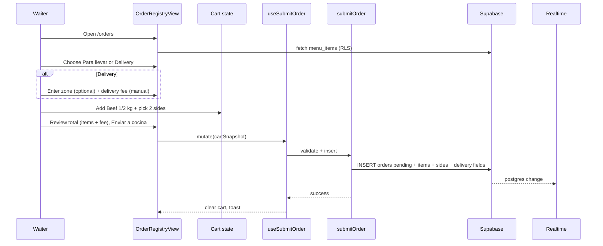

# Design — Order Registration & Kitchen Queue

## Overview

```
Waiter /orders                          Grillmaster /kitchen
  OrderRegistryView                       KitchenQueueView
    → useMenuItems                          → useActiveOrders (['active-orders', merchantId])
    → useCartState (client draft)           → useMarkOrderReady mutation
    → ServiceTypeSelector (take_out | delivery)
    → DeliveryFields (zone optional + fee manual)
    → useSubmitOrder mutation               → useKitchenOrdersRealtime (Supabase channel)
      → submitOrderAction                     → invalidateQueries / cache patch
        → submitOrder use case
          → domain: validateCart, computeItemsSubtotal, computeOrderTotal
          → OrderRepository.insertOrder(...)
            → orders + order_items + order_item_sides
            → Realtime event → kitchen UI updates
```

Bounded context: **`src/domains/orders/`** (replace placeholders). Catalog reads via **`MenuCatalogRepository`** port (implemented in same infrastructure module until a `menu` context exists).

**MVP service focus:** Takeaway and delivery only in waiter UI. `dine_in` exists in DB enum but is not offered.

## Stack references

| Topic | Authority |
|-------|-----------|
| TanStack Query v5 keys | [docs/conventions.md](../../docs/conventions.md) — `['active-orders', merchantId]` |
| Supabase Realtime | [Supabase Realtime postgres changes](https://supabase.com/docs/guides/realtime/postgres-changes) |
| Hexagonal layout | [docs/architecture.md](../../docs/architecture.md) |
| RBAC routes | [specs/multi-tenant-auth/design.md](../multi-tenant-auth/design.md) |
| UI | [DESIGN.md](../../DESIGN.md) — **Live Order Queue Item** |

## User flows

### Flow A — Waiter builds cart and sends to kitchen (takeaway/delivery)



**Default cart state:** `serviceType: 'take_out'`, `deliveryFee: 0`, `deliveryZone: null`, `tableNumber: null`.

### Flow B — Grillmaster sees order in real time

```mermaid
sequenceDiagram
  participant G as Grillmaster
  participant K as KitchenQueueView
  participant Q as useActiveOrders
  participant RT as Realtime channel
  participant DB as Supabase

  G->>K: Open /kitchen (already mounted)
  Q->>DB: SELECT active orders + items
  Note over RT,DB: Waiter submits elsewhere
  DB-->>RT: INSERT orders
  RT-->>Q: invalidate or patch cache
  Q-->>K: re-render new ticket (FIFO)
  Note over K: Badge Para llevar or Delivery; zone/fee if delivery
  G->>K: Marcar listo
  K->>DB: UPDATE status served, ready_at
  K-->>G: ticket leaves active list
```

### Flow C — RBAC enforcement

1. Waiter navigates to `/kitchen` → existing `RoleRouteGate` → redirect `/orders`.
2. Waiter calls mark-ready mutation → use case rejects (`Forbidden`) + RLS blocks UPDATE.
3. Admin may use both surfaces.

### Flow D — Cross-tenant isolation

1. Merchant A session attempts PATCH with merchant B order id.
2. RLS USING clause excludes row → empty result / policy violation.
3. Use case never accepts `merchantId` from client body.

## Data model

### Existing tables (reuse)

From `supabase/migrations/20260825204800_initial_schema_and_onboarding.sql` and [docs/database-schema.md](../../docs/database-schema.md):

- `orders` — header: `merchant_id`, `server_id`, `table_number`, `service_type`, `status`, `total_amount`, timestamps
- `order_items` — lines: `menu_item_id`, `quantity`, `unit_price`, `subtotal`
- `menu_items` — catalog: `merchant_id`, `name`, `price`, `is_active`

**Enum `order_status`:** `pending`, `cooking`, `served`, `completed`, `cancelled` — no `ready` value.

**Enum `service_type`:** `dine_in`, `take_out`, `delivery` — MVP UI uses **`take_out` | `delivery` only**.

### Approved migration

**File:** `supabase/migrations/<timestamp>_order_kitchen_queue.sql`

```sql
-- Menu taxonomy
CREATE TYPE menu_item_kind AS ENUM ('meat_plate', 'drink', 'side');

ALTER TABLE menu_items
  ADD COLUMN item_kind menu_item_kind NOT NULL DEFAULT 'meat_plate',
  ADD COLUMN protein_group TEXT NULL CHECK (protein_group IN ('beef', 'pork', 'chicken')),
  ADD COLUMN weight_label TEXT NULL;

COMMENT ON COLUMN menu_items.item_kind IS 'Sales category: meat plates require two sides; sides are selectable contornos.';
COMMENT ON COLUMN menu_items.protein_group IS 'UI grouping for meat plates (beef, pork, chicken).';
COMMENT ON COLUMN menu_items.weight_label IS 'Display portion label e.g. 1kg, 500g, 250g.';

-- Side selections per order line
CREATE TABLE order_item_sides (
  id UUID PRIMARY KEY DEFAULT uuid_generate_v4(),
  order_item_id UUID NOT NULL REFERENCES order_items(id) ON DELETE CASCADE,
  side_menu_item_id UUID NOT NULL REFERENCES menu_items(id),
  slot SMALLINT NOT NULL CHECK (slot IN (1, 2)),
  UNIQUE (order_item_id, slot)
);

COMMENT ON TABLE order_item_sides IS 'Two included sides per meat plate line.';

CREATE INDEX idx_order_item_sides_item ON order_item_sides(order_item_id);

-- Kitchen timing + delivery (extend existing orders — no parallel model)
ALTER TABLE orders
  ADD COLUMN sent_to_kitchen_at TIMESTAMPTZ,
  ADD COLUMN ready_at TIMESTAMPTZ,
  ADD COLUMN delivery_fee DECIMAL(10, 2) NOT NULL DEFAULT 0.00,
  ADD COLUMN delivery_zone TEXT NULL;

COMMENT ON COLUMN orders.delivery_fee IS 'Manually entered delivery cost at order time. Zero for takeaway.';
COMMENT ON COLUMN orders.delivery_zone IS 'Optional free-text zone label for dispatch (e.g. Centro). Not a FK to a zones catalog.';

-- Optional CHECK: delivery_fee >= 0 (also enforced in domain)
ALTER TABLE orders
  ADD CONSTRAINT orders_delivery_fee_non_negative CHECK (delivery_fee >= 0);

-- Realtime (if not enabled globally)
ALTER PUBLICATION supabase_realtime ADD TABLE orders;

-- Replace permissive order policies with role-aware (see RLS section)
```

**Total amount semantics:** On insert, application sets `total_amount = roundMoney(sum(line subtotals) + delivery_fee)`. No DB generated column required for MVP.

**Takeaway insert:** `service_type = 'take_out'`, `delivery_fee = 0`, `delivery_zone = NULL`, `table_number = NULL`.

**Delivery insert:** `service_type = 'delivery'`, `delivery_fee` from waiter input (`>= 0`), `delivery_zone` optional.

### Domain mapping

| DB column | Domain field |
|-----------|--------------|
| `item_kind` | `itemKind` |
| `protein_group` | `proteinGroup` |
| `weight_label` | `weightLabel` |
| `sent_to_kitchen_at` | `sentToKitchenAt` |
| `ready_at` | `readyAt` |
| `delivery_fee` | `deliveryFee` |
| `delivery_zone` | `deliveryZone` |
| `server_id` | `serverId` |
| `table_number` | `tableNumber` |
| `service_type` | `serviceType` |
| `total_amount` | `totalAmount` |
| `unit_price` | `unitPrice` |

### Active kitchen queue filter (domain pure function)

```typescript
export const ACTIVE_KITCHEN_STATUSES = ["pending", "cooking"] as const;

export function isActiveKitchenOrder(status: OrderStatus): boolean {
  return ACTIVE_KITCHEN_STATUSES.includes(status as (typeof ACTIVE_KITCHEN_STATUSES)[number]);
}

export function sortOrdersChronologically(orders: Order[]): Order[] {
  return [...orders].sort(
    (a, b) => a.sentToKitchenAt.getTime() - b.sentToKitchenAt.getTime(),
  );
}
```

### Status transition (domain)

```typescript
export function assertCanMarkReady(actorRole: UserRole): void {
  if (actorRole !== "grill_master" && actorRole !== "admin") {
    throw new OrderError("FORBIDDEN_MARK_READY");
  }
}

export function markOrderReady(order: Order, now: Date): Order {
  if (!isActiveKitchenOrder(order.status)) {
    throw new OrderError("ORDER_NOT_ACTIVE");
  }
  return {
    ...order,
    status: "served",
    readyAt: now,
    updatedAt: now,
  };
}
```

Product **"Mark as Ready"** → DB **`served`**.

## Domain model (`src/domains/orders/`)

### Entities

```typescript
export type OrderStatus =
  | "pending"
  | "cooking"
  | "served"
  | "completed"
  | "cancelled";

/** MVP cart/UI allows take_out | delivery only. dine_in reserved for future. */
export type MvpServiceType = "take_out" | "delivery";
export type ServiceType = "dine_in" | "take_out" | "delivery";

export type MenuItemKind = "meat_plate" | "drink" | "side";

export type ProteinGroup = "beef" | "pork" | "chicken";

export type MenuItem = {
  id: string;
  merchantId: string;
  name: string;
  price: number;
  itemKind: MenuItemKind;
  proteinGroup: ProteinGroup | null;
  weightLabel: string | null;
  isActive: boolean;
};

export type CartSideSelection = {
  slot: 1 | 2;
  sideMenuItemId: string;
};

export type CartLine = {
  menuItemId: string;
  quantity: number;
  unitPrice: number;
  sides: CartSideSelection[]; // empty for drinks; length 2 for meat
};

export type Cart = {
  serviceType: MvpServiceType;
  deliveryFee: number; // 0 for take_out; >= 0 for delivery
  deliveryZone: string | null; // optional label when delivery
  tableNumber: null; // MVP takeaway/delivery — not collected
  lines: CartLine[];
};

export type OrderItemSide = {
  slot: 1 | 2;
  sideMenuItemId: string;
  sideName: string; // denormalized for kitchen display
};

export type OrderLine = {
  id: string;
  menuItemId: string;
  name: string;
  quantity: number;
  unitPrice: number;
  subtotal: number;
  sides: OrderItemSide[];
};

export type Order = {
  id: string;
  merchantId: string;
  serverId: string | null;
  serverName: string | null;
  tableNumber: number | null;
  serviceType: ServiceType;
  deliveryFee: number;
  deliveryZone: string | null;
  status: OrderStatus;
  totalAmount: number;
  sentToKitchenAt: Date;
  readyAt: Date | null;
  createdAt: Date;
  updatedAt: Date;
  lines: OrderLine[];
};
```

### Cart pure functions (immutable)

```typescript
export function addLineToCart(cart: Cart, line: CartLine): Cart {
  const index = cart.lines.findIndex(
    (l) =>
      l.menuItemId === line.menuItemId &&
      sidesKey(l.sides) === sidesKey(line.sides),
  );
  if (index !== -1) {
    return {
      ...cart,
      lines: cart.lines.map((l, i) =>
        i === index ? { ...l, quantity: l.quantity + line.quantity } : l,
      ),
    };
  }
  return { ...cart, lines: [...cart.lines, line] };
}

export function computeItemsSubtotal(lines: CartLine[]): number {
  return roundMoney(
    lines.reduce((sum, l) => sum + l.unitPrice * l.quantity, 0),
  );
}

export function computeOrderTotal(cart: Cart): number {
  const itemsSubtotal = computeItemsSubtotal(cart.lines);
  const fee = cart.serviceType === "delivery" ? cart.deliveryFee : 0;
  return roundMoney(itemsSubtotal + fee);
}

export function setServiceType(cart: Cart, serviceType: MvpServiceType): Cart {
  if (serviceType === "take_out") {
    return { ...cart, serviceType, deliveryFee: 0, deliveryZone: null };
  }
  return { ...cart, serviceType };
}
```

### Validations (Zod — `domain/validations.ts`)

- `submitOrderSchema`: cart lines, `serviceType` in `take_out` | `delivery`, delivery fee rules, side count = 2 for meat SKUs
- **Delivery:** `deliveryFee` required number, `>= 0`; `deliveryZone` optional string (trim, max length e.g. 100)
- **Takeaway:** reject if `deliveryFee !== 0` or `deliveryZone` set (domain normalizes on service type change)
- `markOrderReadySchema`: `orderId` UUID
- Reuse menu catalog lookup in use case to verify ids belong to merchant and `item_kind` rules

### Ports (`domain/repository.ts`)

```typescript
export interface MenuCatalogRepository {
  listActiveMenu(merchantId: string): Promise<MenuItem[]>;
}

export interface OrderRepository {
  insertOrder(params: {
    merchantId: string;
    serverId: string;
    serviceType: MvpServiceType;
    deliveryFee: number;
    deliveryZone: string | null;
    lines: CartLine[];
    menuCatalog: MenuItem[];
  }): Promise<Order>;

  listActiveOrders(merchantId: string): Promise<Order[]>;

  markReady(params: {
    merchantId: string;
    orderId: string;
    actorRole: UserRole;
  }): Promise<Order>;
}
```

### Use cases (`application/use-cases.ts`)

| Use case | Responsibility |
|----------|----------------|
| `listMenuItems(merchantId, catalogRepo)` | Delegate list |
| `submitOrder(cart, actor, catalogRepo, orderRepo)` | Validate, compute `totalAmount`, insert |
| `listActiveOrders(merchantId, orderRepo)` | Filter/sort via repo or domain helper |
| `markOrderReady(orderId, actor, orderRepo)` | Role check + transition |

## Infrastructure

### Supabase repository

- **`supabase-menu-catalog-repo.ts`** — `SELECT * FROM menu_items WHERE merchant_id = ? AND is_active`
- **`supabase-order-repo.ts`** — transactional insert (prefer RPC if multi-table atomicity needed):

```sql
-- Optional RPC: create_order_with_items(...) SECURITY DEFINER with merchant check
```

For MVP, sequential inserts with rollback on failure are acceptable if wrapped in a Postgres function.

- Join `users.full_name` for `serverName` on kitchen list.
- Join `order_item_sides` + side `menu_items.name` for display.
- Persist `delivery_fee`, `delivery_zone`, `total_amount` on `orders` insert.

### Query adapters (`infrastructure/query-adapters.ts`)

| Hook | Query key / behavior |
|------|----------------------|
| `useMenuItems()` | `['menu-items', merchantId]` — staleTime 5 min |
| `useActiveOrders()` | `['active-orders', merchantId]` — staleTime 0 when Realtime enabled |
| `useSubmitOrder()` | mutation → invalidate `['active-orders', merchantId]` |
| `useMarkOrderReady()` | mutation → invalidate `['active-orders', merchantId]` |

### Realtime adapter (`infrastructure/kitchen-realtime.ts`)

```typescript
export function subscribeActiveOrders(
  supabase: SupabaseClient,
  merchantId: string,
  onChange: () => void,
): () => void {
  const channel = supabase
    .channel(`kitchen-orders:${merchantId}`)
    .on(
      "postgres_changes",
      {
        event: "*",
        schema: "public",
        table: "orders",
        filter: `merchant_id=eq.${merchantId}`,
      },
      () => onChange(),
    )
    .subscribe();

  return () => {
    void supabase.removeChannel(channel);
  };
}
```

`onChange` triggers `queryClient.invalidateQueries({ queryKey: ['active-orders', merchantId] })`.

**Fallback:** `refetchInterval: 5000` when Realtime status !== `SUBSCRIBED`.

Hook: `useKitchenOrdersRealtime()` mounted in `KitchenQueueView` only.

### Server actions

- `submitOrderAction(cartPayload)` — loads session profile; waiter/admin only for insert
- `markOrderReadyAction({ orderId })` — grillmaster/admin only

Pattern: mirror `src/domains/auth/infrastructure/staff-user-action.ts` and raw-materials actions.

## RLS / multi-tenant

Replace blanket policy from initial migration:

```sql
DROP POLICY IF EXISTS "Users can manage orders of their merchant" ON orders;

CREATE POLICY "Staff read orders of their merchant"
ON orders FOR SELECT TO authenticated
USING (merchant_id = get_user_merchant_id());

CREATE POLICY "Waiters and admins insert orders"
ON orders FOR INSERT TO authenticated
WITH CHECK (
  merchant_id = get_user_merchant_id()
  AND get_user_role() IN ('waiter', 'admin')
);

CREATE POLICY "Grillmasters and admins update order status"
ON orders FOR UPDATE TO authenticated
USING (merchant_id = get_user_merchant_id())
WITH CHECK (
  merchant_id = get_user_merchant_id()
  AND get_user_role() IN ('grill_master', 'admin')
);
```

Similar INSERT policies on `order_items` and `order_item_sides` scoped via parent order merchant.

**SELECT** on `order_items` / `order_item_sides`: tenant staff read via order join.

Run `supabase db advisors` after migration.

## UI design

### Waiter — `/orders` (`OrderRegistryView`)

Mobile-first single column; optional two-column on `md+` (menu left, cart right).

| Section | Spec |
|---------|------|
| Header | "Registrar pedido" — `section_title` |
| **Service type** | Segmented control or radio: **Para llevar** (`take_out`) \| **Delivery** (`delivery`). **No dine-in option.** Required before send. |
| **Delivery fields** | Visible when Delivery selected: optional text "Zona" (`delivery_zone`); required numeric "Costo de envío" (`delivery_fee`, `>= 0`, step 0.01). Hidden/cleared for Para llevar. |
| Menu | Accordion or tabs by `protein_group` + drinks; sides hidden from direct add (sides only inside meat modal) |
| Meat add flow | Tap meat SKU → modal/drawer: pick side slot 1 & 2 from side items → confirm quantity |
| Cart panel | Sticky bottom bar on mobile: items subtotal, delivery fee line (if delivery), **total**, **Enviar a cocina** (Flame Red) |
| Line row | Name, weight label, qty stepper, line subtotal (es-ES USD), side names caption |

Flat cards, hairline borders, no shadows.

**Suggested components:**

- `ServiceTypeSelector.tsx` — takeaway/delivery toggle
- `DeliveryDetailsFields.tsx` — zone + fee inputs
- `OrderTotalsSummary.tsx` — subtotal, fee, total with `formatMoneyUsdEs`

### Kitchen — `/kitchen` (`KitchenQueueView`)

Replace stub in `src/app/(app)/kitchen/page.tsx`.

Per DESIGN.md **Live Order Queue Item**:

| Element | Spec |
|---------|------|
| Container | Vertical stack of flat banners, alternating subtle bg (`bg-card` / `bg-muted/30`) |
| Left | Service pill: **Para llevar** or **Delivery** — `primary_translucent` badge. For delivery: secondary line with zone (if set) and formatted delivery fee. |
| Center | Bullet list: `{qty}x {name} ({weight})` + indented sides `· yuca · arepa` |
| Right | Elapsed mm:ss since `sentToKitchenAt`; turns `text-primary` if > `KITCHEN_SLA_MINUTES` (default 20) |
| Action | **Marcar listo** — primary button, min 44px height |

Empty state: "No hay pedidos en cocina."

Connection banner when Realtime reconnecting.

### Route files

| File | Action |
|------|--------|
| `src/app/(app)/orders/page.tsx` | Thin container → `OrderRegistryView` |
| `src/app/(app)/kitchen/page.tsx` | Thin container → `KitchenQueueView` |
| `src/app/(app)/kitchen/loading.tsx` | Optional skeleton list |
| `src/app/(app)/orders/loading.tsx` | Optional menu skeleton |

Existing `orders/layout.tsx` and `kitchen/layout.tsx` RBAC gates unchanged.

### Currency helper (OQ-10 override)

```typescript
const usdEsFormatter = new Intl.NumberFormat("es-ES", {
  style: "currency",
  currency: "USD",
});

export function formatMoneyUsdEs(amount: number): string {
  return usdEsFormatter.format(amount);
}

// Example: formatMoneyUsdEs(44) → "44,00 US$"
```

Use consistently in menu prices, cart lines, delivery fee, and order total. Do **not** use `en-US` for this feature.

## Catalog seed (local/dev)

**File:** `supabase/seeds/order_menu_catalog.sql` (or extend existing seed manifest)

**Merchant scoping:** `menu_items` requires `merchant_id`. Use idempotent **per-merchant** inserts (same pattern as `supabase/snippets/raw items seed.sql`):

```sql
INSERT INTO menu_items (merchant_id, name, item_kind, protein_group, weight_label, price, is_active)
SELECT m.id, c.name, c.item_kind, c.protein_group, c.weight_label, c.price, true
FROM merchants m
CROSS JOIN (VALUES
  ('Beef 1 kg', 'meat_plate', 'beef', '1kg', 44.00),
  -- ...
) AS c(name, item_kind, protein_group, weight_label, price)
WHERE NOT EXISTS (
  SELECT 1 FROM menu_items mi
  WHERE mi.merchant_id = m.id AND lower(mi.name) = lower(c.name)
);
```

Example rows:

| name | item_kind | protein_group | weight_label | price |
|------|-----------|---------------|--------------|-------|
| Beef 1 kg | meat_plate | beef | 1kg | 44.00 |
| Beef 1/2 kg | meat_plate | beef | 500g | 24.00 |
| Beef 1/4 kg | meat_plate | beef | 250g | 13.00 |
| Pork belly 1 kg | meat_plate | pork | 1kg | 42.00 |
| … | … | … | … | … |
| Nestea | drink | null | null | 3.50 |
| Coca-Cola | drink | null | null | 1.30 |
| Yuca | side | null | null | 0.00 |
| Arepa | side | null | null | 0.00 |
| Shredded salad | side | null | null | 0.00 |

PDF [menu-example.pdf](../../docs/business/menu-example.pdf) is reference for naming.

Display in UI uses es-ES formatting (e.g. beef 1 kg → `44,00 US$`).

## Test strategy

Automated verification spans **three layers**. RTL integration is **required** for the waiter → kitchen → mark-ready happy path (FR-11, AC-20–AC-23).

### Layer matrix

| Layer | Runner | Environment | Real | Mocked / faked |
|-------|--------|-------------|------|----------------|
| Domain | Vitest | `node` | Pure cart/status/validation functions | — |
| Application | Vitest | `node` | Use cases | In-memory repos (`vi.fn()` or shared store — see `raw-materials/application/use-cases.test.ts`) |
| Presentation integration | Vitest + RTL | `jsdom` | Components, hooks, TanStack Query client, Spanish UI strings | Supabase repos, server actions, Realtime subscription |

**MSW:** Not used in this repo today. **Prefer in-memory fake repositories** implementing hexagonal ports over HTTP mocking.

### In-memory fake repositories (shared store)

**File:** `src/domains/orders/infrastructure/testing/in-memory-order-repos.ts`

- Implement `MenuCatalogRepository.listActiveMenu` returning a **fixture catalog** aligned with seed data (beef ½ kg, drinks, yuca/arepa/ensalada sides).
- Implement `OrderRepository.insertOrder`, `listActiveOrders`, `markReady` against a **mutable in-memory array** scoped to `merchantId`.
- `insertOrder` assigns ids, sets `status: pending`, `sentToKitchenAt`, computes and stores `totalAmount`, snapshots sides on lines.
- `listActiveOrders` filters `pending` \| `cooking`, sorts by `sentToKitchenAt` ASC (domain helper).
- `markReady` transitions to `served`, sets `readyAt`, removes from active filter.
- Export factory `createInMemoryOrderRepos()` returning `{ catalogRepo, orderRepo, getOrdersSnapshot }` for assertions.

Server actions in tests: either (A) call use cases directly from mutation functions under test, or (B) mock `submitOrderAction` / `markOrderReadyAction` to invoke use cases + fakes — **no Supabase client**.

### Query + Realtime in tests

- Wrap renders in `QueryClientProvider` with test client: `{ defaultOptions: { queries: { retry: false }, mutations: { retry: false } } }`.
- **`useKitchenOrdersRealtime`:** stub to no-op unsubscribe (no Supabase channel). Production behavior under test: `useSubmitOrder` / `useMarkOrderReady` **`onSuccess` → `queryClient.invalidateQueries({ queryKey: ['active-orders', merchantId] })`** refreshes kitchen list from fake repo — sufficient for RTL without live Realtime.
- Optional: fake repo invokes an `onChange` callback mimicking Realtime; not required if mutations invalidate.

**OQ-6 unchanged:** RTL does **not** satisfy AC-6 alone. Manual two-browser Realtime smoke remains required.

### Test harness

**File:** `src/domains/orders/presentation/testing/render-with-order-providers.tsx`

```typescript
type RenderOrdersOptions = {
  profile: SessionProfile; // waiter or grill_master
  repos?: ReturnType<typeof createInMemoryOrderRepos>;
};

export function renderWithOrderProviders(
  ui: React.ReactElement,
  options: RenderOrdersOptions,
) {
  // QueryClientProvider + inject repos via React context or module test doubles
  // Session profile stub for role-aware UI (hide Marcar listo for waiter)
}
```

**Dependency injection:** Presentation hooks (`useMenuItems`, `useSubmitOrder`, etc.) must accept repos in tests — via optional context provider `OrdersTestProviders` or `vi.mock` of infrastructure module pointing at fakes. Implementer picks one approach; **must not** import `@supabase/supabase-js` in presentation tests.

### Single-scenario flow (recommended)

One test file, one shared `QueryClient` + fake store per test:

1. Render `OrderRegistryView` as **waiter** `SessionProfile`.
2. `userEvent`: select **Para llevar** or **Delivery**, add meat SKU, pick two sides in modal, submit **Enviar a cocina**.
3. Assert toast/cart cleared (if applicable).
4. Re-render or mount `KitchenQueueView` as **grill_master** with **same** `QueryClient` and fake repos.
5. Assert kitchen DOM: badge, lines, sides, delivery zone/fee when delivery.
6. Assert fake repo snapshot: `serviceType`, `deliveryFee`, `deliveryZone`, `totalAmount`, line sides.
7. `userEvent`: click **Marcar listo** → ticket absent from active list; repo order `status === 'served'`.

Alternative: thin `OrderKitchenTestApp` wrapper rendering both views behind tabs for one mount — acceptable if simpler.

### Vitest configuration

Current repo (`vitest.config.ts`): `environment: "node"`, `include: ["src/**/*.test.ts"]` only — **no RTL deps yet**.

Implementer extends config:

```typescript
test: {
  environment: "node",
  include: ["src/**/*.test.ts", "src/**/*.integration.test.tsx"],
  environmentMatchGlobs: [
    ["src/**/*.integration.test.tsx", "jsdom"],
  ],
  setupFiles: ["src/domains/orders/presentation/testing/setup-integration.ts"], // @testing-library/jest-dom
},
```

Add devDependencies: `@testing-library/react`, `@testing-library/user-event`, `@testing-library/jest-dom`, `jsdom`.

### Recommended test file paths

| Path | Purpose |
|------|---------|
| `src/domains/orders/infrastructure/testing/in-memory-order-repos.ts` | Shared fake repos + catalog fixture |
| `src/domains/orders/infrastructure/testing/menu-catalog-fixture.ts` | Seed-aligned menu items for tests |
| `src/domains/orders/presentation/testing/render-with-order-providers.tsx` | RTL render helper |
| `src/domains/orders/presentation/testing/setup-integration.ts` | jest-dom import, cleanup |
| `src/domains/orders/presentation/order-kitchen-flow.integration.test.tsx` | **Primary** — takeaway + delivery + mark ready scenarios |
| `src/domains/orders/domain/*.test.ts` | Unit tests (unchanged) |
| `src/domains/orders/application/use-cases.test.ts` | Application unit tests (unchanged) |

### Manual-only verification (post-RTL)

| Concern | Why manual |
|---------|------------|
| Realtime <3s (AC-6) | Requires live Supabase channel |
| RLS cross-tenant (AC-11) | Policy enforcement in Postgres |
| RBAC route redirect (AC-9) | Next.js middleware / layout gates |
| Live seed smoke | Real `supabase db reset` + browser |

## Performance budgets

| Metric | Budget | Notes |
|--------|--------|-------|
| `/orders` LCP | < 2.5s mobile | Menu query + render; no charts |
| `/kitchen` LCP | < 2.5s mobile | Active list ≤ 50 rows |
| Realtime update latency | < 3s p95 | Measured manual L2 AC-6 |
| CLS | < 0.1 | Fixed cart bar height; skeleton for queue |
| JS bundle | Avoid heavy imports | No chart libraries on these routes |
| Query staleTime | menu 5 min; active orders 0 | Realtime drives freshness |

**MVP vs later (OQ-11):**

| Technique | MVP | Later |
|-----------|-----|-------|
| TanStack Query + Realtime | ✓ | — |
| `invalidateQueries` on mutation | ✓ | — |
| Route `loading.tsx` skeleton | ✓ | — |
| `next/dynamic` for subviews | Only if needed | Split modals |
| Suspense streaming per order row | Defer | High-volume service |

## Realtime strategy summary

| Approach | Verdict |
|----------|---------|
| **Supabase Realtime on `orders` + Query invalidate** | **Approved** |
| TanStack `refetchInterval` | Fallback / degraded mode |
| Mutation-only invalidation | **Rejected** for kitchen (multi-device) |
| Polling alone | Acceptable only as fallback |

Document publication enablement in `docs/supabase.md` when implementer adds table to `supabase_realtime`.

## Error handling

| Case | UI |
|------|-----|
| Missing sides | Inline Spanish on meat modal |
| Empty cart submit | Disabled button |
| Delivery without fee field | Inline "Ingresa el costo de envío" |
| Invalid fee (< 0) | Inline validation |
| RLS / network failure | Toast "No se pudo enviar el pedido." |
| Mark ready on inactive order | Toast "Pedido no disponible." |
| Realtime disconnected | Banner "Reconectando…" + polling fallback |

## File touch list (implementation reference)

| Path | Action |
|------|--------|
| `supabase/migrations/<ts>_order_kitchen_queue.sql` | Schema + RLS + Realtime + delivery columns |
| `supabase/seeds/order_menu_catalog.sql` | Per-merchant dev menu seed |
| `src/domains/orders/domain/*` | Entities, validations, cart, status |
| `src/domains/orders/domain/*.test.ts` | Vitest (node) |
| `src/domains/orders/application/use-cases.test.ts` | Vitest (node) |
| `src/domains/orders/infrastructure/testing/in-memory-order-repos.ts` | Fake repos for RTL + application tests |
| `src/domains/orders/presentation/testing/render-with-order-providers.tsx` | RTL harness |
| `src/domains/orders/presentation/order-kitchen-flow.integration.test.tsx` | RTL integration (required) |
| `vitest.config.ts` | jsdom glob for `*.integration.test.tsx` |
| `src/domains/orders/application/use-cases.ts` | Use cases |
| `src/domains/orders/infrastructure/supabase-*-repo.ts` | Repos |
| `src/domains/orders/infrastructure/query-adapters.ts` | Hooks |
| `src/domains/orders/infrastructure/kitchen-realtime.ts` | Subscription |
| `src/domains/orders/infrastructure/*-action.ts` | Server actions |
| `src/domains/orders/presentation/format-money.ts` | es-ES USD helper |
| `src/domains/orders/presentation/ServiceTypeSelector.tsx` | Takeaway/delivery |
| `src/domains/orders/presentation/DeliveryDetailsFields.tsx` | Zone + fee |
| `src/domains/orders/presentation/OrderRegistryView.tsx` | Waiter UI |
| `src/domains/orders/presentation/KitchenQueueView.tsx` | Kitchen UI |
| `src/app/(app)/orders/page.tsx` | Wire view |
| `src/app/(app)/kitchen/page.tsx` | Replace stub |
| `docs/database-schema.md` | Update post-migration |

## Deferred / follow-up

| Item | Feature |
|------|---------|
| Menu admin CRUD | Future `menu-catalog` spec |
| Payment + `completed` status | Payments spec |
| Dine-in UI + table number flow | Order lifecycle v2 |
| Auto delivery pricing / zones catalog | Delivery management spec |
| Recipe inventory deduction | Product §5 |
| `table_sessions_log` writes | Metrics spec |
| Waiter "picked up" / served confirmation | Order lifecycle v2 |
| Role-specific RLS for all tables | Security hardening spec |
| Physical ticket printer | Out of MVP |
