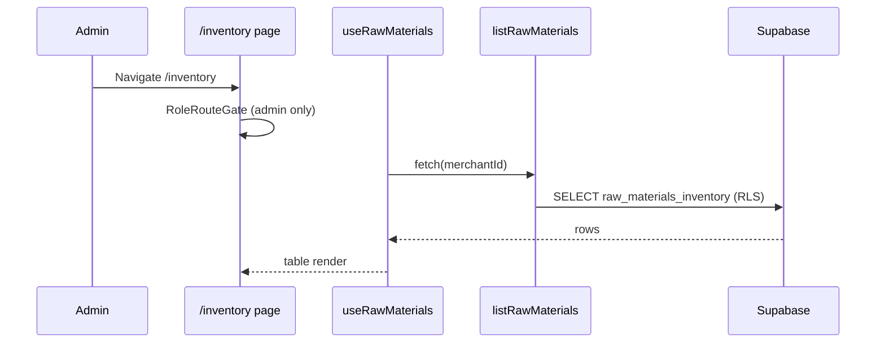

# Design — Raw Materials Inventory Management

## Overview

```
(app)/inventory/page.tsx  (view container)
  → presentation/InventoryView.tsx
    → query-adapters (useRawMaterials, useCreateRawMaterial, …)
      → server actions (infrastructure/*-action.ts)
        → application/use-cases.ts
          → domain/updateWeightedAverageCost, validations
          → infrastructure/supabase-repo.ts
            → Supabase Postgres (RLS: tenant SELECT, admin writes)
            → inventory_movements (receipt audit)
```

Single bounded context: **`src/domains/raw-materials/`** — catalog and inventory in one module. No separate `catalog` domain.

## User flows

### Flow A — Admin lists inventory



### Flow B — Admin creates item

1. Admin clicks **"Nuevo insumo"** → Dialog opens.
2. Fields: **Nombre**, **SKU (opcional)**, **Unidad de medida** (select: Kilogramo / Unidad).
3. Submit → `createRawMaterialAction` → use case validates → INSERT.
4. Initial stock `0`, WAC `0.00`.
5. Dialog closes; list invalidates `['raw-materials', merchantId]`.

### Flow C — Admin receives stock

1. Admin clicks **"Registrar entrada"** on a row → Dialog opens.
2. Fields: **Cantidad** (step `0.001` for **both** `kilogram` and `unit` — fractional packs allowed), **Costo unitario de compra** (currency).
3. Submit → `receiveStockAction`:
   - Load current item
   - `updateWeightedAverageCost(...)` in domain
   - UPDATE inventory row
   - INSERT `inventory_movements` row
4. Toast success; list refreshes; optional movement snippet in dialog history.

### Flow D — Admin deactivates item

1. Admin opens edit dialog → **"Desactivar insumo"** (destructive secondary).
2. Confirm → `deactivateRawMaterial` sets `is_active = false`.
3. Item disappears from default list (filter active only).

### Flow E — Grill master blocked (default)

1. Onboarded `grill_master` navigates to `/inventory`.
2. `RoleRouteGate` → `resolveRoleRedirect('grill_master', '/inventory')` → `/kitchen`.
3. Sidebar does not show Inventario (OQ-3 locked: full block, no read-only).

### Flow F — Cross-tenant isolation

1. Merchant A admin session attempts read/write with merchant B `id` in payload.
2. RLS filters SELECT; INSERT/UPDATE WITH CHECK fails on `merchant_id` mismatch.
3. Use case never trusts client `merchantId`.

## Suggested UoM mapping (floor catalog)

Spanish display names for the **required local/dev seed** — UoM values are seed defaults (admin can create other UoM for new items; existing item UoM is immutable):

| Name | Suggested `unit_of_measure` | Rationale |
|------|------------------------------|-----------|
| Carne | `kilogram` | Bulk meat by weight |
| Pollo | `kilogram` | Whole/bulk poultry by weight |
| Cochino | `kilogram` | Bulk pork by weight |
| Sal gruesa | `kilogram` | Typically bought bulk; packet buyers may create a separate `unit` item |
| Pimienta | `kilogram` | Spice by weight; packet option as a new `unit` item |
| Carbón | `kilogram` | Bulk charcoal by weight |
| Aceite | `kilogram` | Bulk/refill default; bottle/jar → admin may create `unit` (OQ-9) |
| Verduras | `kilogram` | Produce by weight |
| Mostaza | `kilogram` | Bulk refill default; jar → `unit` |
| Mayonesa | `kilogram` | Bulk refill default; jar → `unit` |
| Miel | `kilogram` | Bulk default; jar → `unit` |
| Papel aluminio | `unit` | Roll/box count (OQ-10 locked) |
| Envases | `unit` | Discrete containers |
| Bolsas | `unit` | Pack count |
| Cubiertos | `unit` | Piece count |
| Toallin | `unit` | Roll/pack count |
| Guantes | `unit` | Pair/box count |
| Cubito | `unit` | Bag count (OQ-8); fractions of a bag allowed (OQ-1) |

## Data model

### PostgreSQL enum

```sql
CREATE TYPE unit_of_measure AS ENUM ('kilogram', 'unit');
```

### Table: `raw_materials_inventory` (evolved)

Replace kg-only model with UoM-agnostic quantity:

| Column | Type | Notes |
|--------|------|-------|
| `id` | UUID PK | unchanged |
| `merchant_id` | UUID FK | unchanged |
| `name` | VARCHAR(100) NOT NULL | |
| `sku` | VARCHAR(50) NULL | optional |
| `unit_of_measure` | `unit_of_measure` NOT NULL | set at create; immutable in app |
| `quantity_on_hand` | DECIMAL(10,3) NOT NULL DEFAULT 0 | Both UoM: 3 decimal digits; **fractions allowed for `unit`** |
| `unit_cost` | DECIMAL(10,2) NOT NULL DEFAULT 0.00 | WAC per UoM |
| `is_active` | BOOLEAN NOT NULL DEFAULT true | soft deactivate (OQ-6 locked) |
| `last_updated` | TIMESTAMPTZ NOT NULL DEFAULT NOW() | bump on any stock/cost change |

**Remove:** `stock_kg` after backfill.

**Domain mapping:**

| DB column | Domain field |
|-----------|--------------|
| `quantity_on_hand` | `quantityOnHand` |
| `unit_of_measure` | `unitOfMeasure` |
| `unit_cost` | `unitCost` |
| `is_active` | `isActive` |
| `last_updated` | `updatedAt` |

### Table: `inventory_movements` (new)

| Column | Type | Notes |
|--------|------|-------|
| `id` | UUID PK DEFAULT uuid_generate_v4() | |
| `merchant_id` | UUID NOT NULL FK merchants | tenant scope |
| `raw_material_id` | UUID NOT NULL FK raw_materials_inventory | |
| `movement_type` | TEXT NOT NULL CHECK (movement_type = 'receipt') | MVP: receipts only |
| `quantity` | DECIMAL(10,3) NOT NULL CHECK (quantity > 0) | same precision rules as item UoM |
| `unit_cost` | DECIMAL(10,2) NOT NULL CHECK (unit_cost >= 0) | purchase cost for this receipt |
| `recorded_by` | UUID FK users | `auth.uid()` at insert |
| `created_at` | TIMESTAMPTZ NOT NULL DEFAULT NOW() | |

Index: `(merchant_id, raw_material_id, created_at DESC)`.

COMMENT: `'Audit log of inventory inward receipts; outbound types added in future specs.'`

### CHECK constraints (migration)

```sql
-- quantity non-negative
ALTER TABLE raw_materials_inventory
  ADD CONSTRAINT raw_materials_quantity_non_negative
  CHECK (quantity_on_hand >= 0);

-- Unique name per merchant among active items (OQ-5 locked)
CREATE UNIQUE INDEX idx_raw_materials_merchant_name_active
  ON raw_materials_inventory (merchant_id, lower(trim(name)))
  WHERE is_active = true;
```

Do **not** add a CHECK that `unit` quantities must be integers. Domain + Zod allow fractions for both UoM with max 3 decimal digits (OQ-1 locked).

### Migration plan

File: `supabase/migrations/<timestamp>_raw_materials_dual_uom.sql`

**Steps:**

1. `CREATE TYPE unit_of_measure AS ENUM ('kilogram', 'unit');`
2. `ALTER TABLE raw_materials_inventory ADD COLUMN unit_of_measure unit_of_measure;`
3. `UPDATE raw_materials_inventory SET unit_of_measure = 'kilogram' WHERE unit_of_measure IS NULL;`
4. `ALTER TABLE raw_materials_inventory ALTER COLUMN unit_of_measure SET NOT NULL;`
5. `ALTER TABLE raw_materials_inventory RENAME COLUMN stock_kg TO quantity_on_hand;`
6. `ALTER TABLE raw_materials_inventory ADD COLUMN is_active BOOLEAN NOT NULL DEFAULT true;`
7. `COMMENT ON TABLE raw_materials_inventory IS 'Raw supplies catalog and on-hand stock; kilogram or unit count per item.';`
8. `CREATE TABLE inventory_movements (...);` + index + RLS enable
9. `CREATE OR REPLACE FUNCTION get_user_role() RETURNS user_role ...`
10. Drop policy `"Admins and Grill Masters can modify inventory"`
11. Create policies:
    - `"Users can read inventory of their merchant"` — SELECT (unchanged)
    - `"Admins can insert inventory for their merchant"` — INSERT admin + tenant
    - `"Admins can update inventory for their merchant"` — UPDATE admin + tenant
    - `"Admins can delete inventory for their merchant"` — DELETE admin + tenant (if hard delete ever needed; soft update uses UPDATE)
12. Mirror policies on `inventory_movements`
13. Add CHECK constraints and the partial unique index on active names

**Apply locally:**

```bash
pnpm dlx supabase migration new raw_materials_dual_uom
# edit SQL file
pnpm dlx supabase db reset
```

**Regenerate types:**

```bash
pnpm dlx supabase gen types typescript --local > src/shared/infrastructure/database/supabase.types.ts
```

### Downstream impact

| Consumer | Impact |
|----------|--------|
| `recipe_ingredients.quantity_kg` | Unchanged; only meaningful for `kilogram` items |
| `waste_logs.weight_kg` | Unchanged; waste feature assumes kg |
| `docs/metrics.md` Food Cost % | Uses `unit_cost` — works per-UoM once recipes exist |
| `feature_list.json` future order/waste features | Must handle count insumos separately |

## Domain layer

### Entities (`domain/entities.ts`)

```typescript
export type UnitOfMeasure = 'kilogram' | 'unit';

export interface RawMaterial {
  id: string;
  merchantId: string;
  name: string;
  sku: string | null;
  unitOfMeasure: UnitOfMeasure;
  quantityOnHand: number;
  unitCost: number;
  isActive: boolean;
  updatedAt: Date;
}

export interface InventoryMovement {
  id: string;
  merchantId: string;
  rawMaterialId: string;
  movementType: 'receipt';
  quantity: number;
  unitCost: number;
  recordedBy: string;
  createdAt: Date;
}

export interface ReceiveStockInput {
  incomingQuantity: number;
  incomingUnitCost: number;
}
```

### WAC (`domain/weighted-average-cost.ts`)

Pure exported functions:

```typescript
export function roundMoney(value: number): number;
export function roundQuantityForUom(value: number, uom: UnitOfMeasure): number;

export type WeightedAverageCostResult = {
  quantityOnHand: number;
  unitCost: number;
};

export function updateWeightedAverageCost(params: {
  currentQuantity: number;
  currentUnitCost: number;
  incomingQuantity: number;
  incomingUnitCost: number;
}): WeightedAverageCostResult;
```

Throws or returns `Result` type via companion validator — prefer domain error type consistent with auth domain (`RawMaterialError`).

### Validations (`domain/validations.ts`)

Zod schemas:

- `createRawMaterialInputSchema`
- `updateRawMaterialInputSchema`
- `receiveStockInputSchema` — quantity ≥ 0 with max 3 fractional digits for **both** UoM values (fractions allowed for `unit`)

Helpers:

- `validateQuantityForUom(quantity, uom)`
- `mapZodIssuesToFieldErrors`

### Repository port (`domain/repository.ts`)

```typescript
export interface RawMaterialRepository {
  listByMerchant(merchantId: string, filters?: { activeOnly?: boolean }): Promise<RawMaterial[]>;
  getById(id: string): Promise<RawMaterial | null>;
  create(input: CreateRawMaterialPayload): Promise<RawMaterial>;
  update(id: string, input: UpdateRawMaterialPayload): Promise<RawMaterial>;
  deactivate(id: string): Promise<RawMaterial>;
  applyReceipt(params: {
    rawMaterialId: string;
    quantityOnHand: number;
    unitCost: number;
    movement: Omit<InventoryMovement, 'id' | 'createdAt'>;
  }): Promise<RawMaterial>;
  listMovements(rawMaterialId: string, limit?: number): Promise<InventoryMovement[]>;
}
```

`applyReceipt` should run inventory UPDATE + movement INSERT in a **single transaction** (Supabase RPC or sequential with rollback strategy — implementer choice; document in progress if using RPC).

## Application layer (`application/use-cases.ts`)

| Use case | Actor check | Notes |
|----------|-------------|-------|
| `listRawMaterials(profile, filters, repo)` | admin for route; repo RLS backs | |
| `createRawMaterial(input, profile, repo)` | `profile.role === 'admin'` | |
| `updateRawMaterial(id, input, profile, repo)` | admin | reject UoM change |
| `deactivateRawMaterial(id, profile, repo)` | admin | |
| `receiveStock(id, input, profile, repo)` | admin | calls WAC then `applyReceipt` |

Actor profile type: reuse `SessionProfile` from auth domain.

## Infrastructure

### Supabase repository (`infrastructure/supabase-repo.ts`)

- Maps snake_case ↔ camelCase
- Implements port with user-scoped `createClient()` from server
- No WAC logic

### Server actions (pattern from `staff-user-action.ts`)

- `createRawMaterialAction`
- `updateRawMaterialAction`
- `deactivateRawMaterialAction`
- `receiveStockAction`

Each: `"use server"` → `getServerSessionProfile()` → use case → mapped Spanish errors.

### Query adapters (`infrastructure/query-adapters.ts`)

```typescript
// Keys
['raw-materials', merchantId, { activeOnly: true }]
['raw-materials', merchantId, rawMaterialId, 'movements']

// Hooks
useRawMaterials(merchantId, filters)
useRawMaterialMovements(merchantId, rawMaterialId)
useCreateRawMaterial()
useUpdateRawMaterial()
useDeactivateRawMaterial()
useReceiveStock()
```

Mutations invalidate `['raw-materials', merchantId]`.

## Presentation & UI

Follow [DESIGN.md](../../DESIGN.md): flat cards, hairline borders, Flame Red primary, weights 300/400/600/700, no heavy shadows.

### Page structure (`src/app/(app)/inventory/page.tsx`)

Thin container rendering `InventoryView` from presentation.

### Components (presentation/)

| Component | Purpose |
|-----------|---------|
| `InventoryView` | Page layout: title, "Nuevo insumo" button, table |
| `RawMaterialTable` | shadcn `Table` — columns with unit suffixes on quantities |
| `RawMaterialFormDialog` | Create/edit — shadcn `Dialog` + `Form` |
| `ReceiveStockDialog` | Receipt form + optional recent movements list |
| `UnitOfMeasureSelect` | Maps enum → Spanish labels |
| `QuantityDisplay` | Formats number + `kg` / `pz` suffix |

### Spanish UI copy (reference)

| Key | Text |
|-----|------|
| Page title | Inventario de insumos |
| New button | Nuevo insumo |
| Receive action | Registrar entrada |
| Name label | Nombre |
| SKU label | SKU (opcional) |
| UoM label | Unidad de medida |
| Quantity label | Cantidad en stock |
| Unit cost label | Costo unitario (promedio) |
| Incoming qty | Cantidad recibida |
| Purchase cost | Costo unitario de compra |
| Deactivate | Desactivar insumo |
| Empty state | No hay insumos registrados |
| Loading | Cargando inventario… |
| Error | No se pudo cargar el inventario |

Currency: format as `$XX.XX` (locale `es-MX` or project standard).

### shadcn primitives

Install if missing: `table`, `dialog`, `form`, `input`, `select`, `button`, `badge` (active/inactive).

Reuse existing shared UI under `src/shared/presentation/ui/`.

### RBAC layout change

```typescript
// src/app/(app)/inventory/layout.tsx
<RoleRouteGate route="/inventory" allowedRoles={["admin"]}>
```

Update `rbac.ts` matrix and tests accordingly.

## Performance budgets

| Metric | Target |
|--------|--------|
| Inventory list payload | < 100 KB for 200 rows |
| Client JS | No chart libraries; table-only page |
| Queries | 1 list query on mount; movements lazy-load on dialog open |
| Mutation feedback | Optimistic UI **not** required; invalidate on success |

Inventory is **not** chart-heavy; keep simple server-backed table.

## Vitest coverage (TDD first)

Colocate tests:

- `domain/weighted-average-cost.test.ts` — WAC edge cases (AC-5)
- `domain/validations.test.ts` — UoM quantity rules including fractional `unit` (AC-6)
- `application/use-cases.test.ts` — receive orchestration with fake repo (AC-7)

Follow AAA per `docs/testing.md`. No Supabase in domain tests.

## Auth matrix follow-up note for implementer

After this feature, update `specs/multi-tenant-auth/requirements.md` FR-8 matrix in a **separate doc patch** (leader/spec_author) OR append amendment note in `progress/raw-materials-inventory.md`:

- `/inventory`: admin only (was admin + grill_master)
- grill_master nav: remove Inventario

Do not silently edit closed multi-tenant-auth spec without leader approval; progress journal amendment is sufficient for MVP.

## Local/dev seed (required — OQ-7)

**Not a production migration. Not called from onboarding RPC.**

Files:

- `supabase/seeds/dev_raw_materials.sql` — INSERT of the 18 names + suggested `unit_of_measure` from the table above (English SQL identifiers only).
- Wire via `supabase/config.toml` `[db.seed]` (today `sql_paths = ["./seed.sql"]`). Prefer `supabase/seed.sql` that `\i` includes `./seeds/dev_raw_materials.sql`, or expand `sql_paths` to include `./seeds/*.sql`. Document in `docs/supabase.md`.

**Attachment:**

```sql
-- Idempotent sketch (implementer may refine)
INSERT INTO raw_materials_inventory (merchant_id, name, unit_of_measure, quantity_on_hand, unit_cost, is_active)
SELECT m.id, c.name, c.uom, 0, 0, true
FROM merchants m
CROSS JOIN (
  VALUES
    ('Carne', 'kilogram'::unit_of_measure),
    ('Pollo', 'kilogram'::unit_of_measure),
    ('Cochino', 'kilogram'::unit_of_measure),
    ('Sal gruesa', 'kilogram'::unit_of_measure),
    ('Pimienta', 'kilogram'::unit_of_measure),
    ('Envases', 'unit'::unit_of_measure),
    ('Bolsas', 'unit'::unit_of_measure),
    ('Cubiertos', 'unit'::unit_of_measure),
    ('Toallin', 'unit'::unit_of_measure),
    ('Guantes', 'unit'::unit_of_measure),
    ('Carbón', 'kilogram'::unit_of_measure),
    ('Aceite', 'kilogram'::unit_of_measure),
    ('Cubito', 'unit'::unit_of_measure),
    ('Verduras', 'kilogram'::unit_of_measure),
    ('Mostaza', 'kilogram'::unit_of_measure),
    ('Mayonesa', 'kilogram'::unit_of_measure),
    ('Miel', 'kilogram'::unit_of_measure),
    ('Papel aluminio', 'unit'::unit_of_measure)
) AS c(name, uom)
WHERE NOT EXISTS (
  SELECT 1 FROM raw_materials_inventory r
  WHERE r.merchant_id = m.id AND lower(trim(r.name)) = lower(trim(c.name))
);
```

**QA workflow:** `db reset` → complete merchant onboarding (creates `merchants` row) → re-run `pnpm dlx supabase db seed` so the 18 items attach. If seed runs with zero merchants, it inserts nothing — document this; do not invent Spanish tables or production-wide catalog INSERTs.

**Forbidden:** inserting these 18 rows inside `create_merchant_and_admin_profile` or any production migration.
