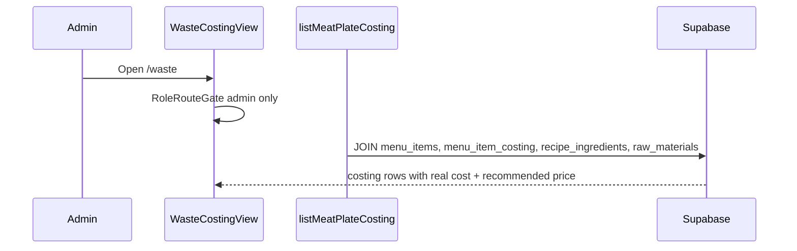

# Design — Waste Cost Calculator (Merma & Costing)

## Overview

```
Admin /waste (Merma y costos)
  WasteCostingView
    → useMeatPlateCostingRows(['meat-plate-costing', merchantId])
    → useUpdateWastePct / useUpdateTargetFoodCostPct
      → server actions (admin session guard)
        → waste application use cases
          → domain/cost-formulas.ts
          → infrastructure/supabase-costing-repo.ts

Waiter /orders — served orders
  CompleteOrderControl
    → completeOrderAction
      → orders application completeOrder use case
        → domain/recipe-deduction.ts (pure aggregation, NO merma %)
        → RPC complete_order_and_deduct_inventory (atomic + idempotent)
          → orders.status = completed, inventory_deducted_at
          → raw_materials_inventory.quantity_on_hand -= appliedKg (clamped)
          → inventory_movements (order_deduction)
```

Bounded contexts:

- **`src/domains/waste/`** — costing, merma config, recipe deduction domain logic, inventory deduction port.
- **`src/domains/orders/`** — order completion transition (`served` → `completed`) and presentation hook.

**In scope:** costing migration, deduction migration/RPC, minimal waiter completion UI.

**Not in this slice:** `waste_logs` INSERT UI, payment capture, auto-apply menu prices.

## Stack references

| Topic | Authority |
|-------|-----------|
| Hexagonal layout | [docs/architecture.md](../../docs/architecture.md) |
| RBAC | [specs/multi-tenant-auth/design.md](../multi-tenant-auth/design.md) — **narrowed** for `/waste` |
| Order statuses | [specs/order-kitchen-queue/design.md](../order-kitchen-queue/design.md) — `served` ≠ checkout |
| UI | [DESIGN.md](../../DESIGN.md) — flat cards/tables |
| Menu entities | [src/domains/orders/domain/entities.ts](../../src/domains/orders/domain/entities.ts) — `OrderStatus` |
| Order transitions today | [src/domains/orders/domain/order-status.ts](../../src/domains/orders/domain/order-status.ts) — `markOrderReady` → `served` only |
| Inventory WAC + stock | [src/domains/raw-materials/domain/weighted-average-cost.ts](../../src/domains/raw-materials/domain/weighted-average-cost.ts) |
| Stock column | `raw_materials_inventory.quantity_on_hand` ([docs/database-schema.md](../../docs/database-schema.md)) |
| Receipt RPC pattern | `apply_inventory_receipt` in `supabase/migrations/20260903140000_raw_materials_dual_uom.sql` |
| Money display | [src/domains/orders/presentation/format-money.ts](../../src/domains/orders/presentation/format-money.ts) |

## User flows

### Flow A — Admin reviews costing table

(Same as prior spec — admin-only `/waste`.)



### Flow B — Admin updates merma %

1. Admin edits **Merma %** inline.
2. `updateWastePctAction` → UPSERT `menu_item_costing`.
3. Row recalculates using **cost formulas only** (yield/real cost/optimal price).

### Flow C — Admin updates target food cost %

1. Admin edits **Costo meta %** in page header.
2. UPDATE `merchants.target_food_cost_pct`.
3. All recommended prices refresh.

### Flow D — RBAC denial (grillmaster / waiter on /waste)

- `grill_master` → redirect `/kitchen`; nav excludes `/waste`.
- `waiter` → redirect `/orders`.

### Flow E — Waiter completes order → inventory deduction (§5.2)

**Trigger:** `order_status` transitions to **`completed`**.

**Not a trigger:** grillmaster **Marcar listo** → `served` ([order-kitchen-queue FR-5](../../specs/order-kitchen-queue/requirements.md)).

```mermaid
sequenceDiagram
  participant W as Waiter
  participant UI as OrdersView
  participant UC as completeOrder
  participant DOM as aggregateRecipeDeductions
  participant RPC as complete_order_and_deduct_inventory
  participant DB as Postgres

  W->>UI: Completar pedido (served order)
  UI->>UC: completeOrder(orderId, session)
  UC->>DOM: aggregate lines × recipe quantity_kg (no merma %)
  UC->>RPC: orderId, deduction map
  RPC->>DB: BEGIN (implicit in plpgsql)
  RPC->>DB: LOCK order; verify served + same merchant
  alt already completed + inventory_deducted_at set
    RPC-->>UC: idempotent success (no stock change)
  else first completion
    RPC->>DB: UPDATE orders SET status=completed, inventory_deducted_at=NOW()
    loop each raw_material_id
      RPC->>DB: appliedKg = min(requested, quantity_on_hand)
      RPC->>DB: UPDATE quantity_on_hand = quantity_on_hand - appliedKg (clamp 0)
      RPC->>DB: INSERT inventory_movements order_deduction + metadata
    end
  end
  RPC-->>UI: success (+ optional partial warnings)
```

**Actors:** `waiter`, `admin`. **Not** `grill_master`.

**UI placement:** `/orders` — section or list item action for orders with `status = 'served'`. Spanish label **“Completar pedido”**. No payment fields. Admin may use same control for testing.

**Domain transition** (`src/domains/orders/domain/order-completion.ts` — new file):

```typescript
export function completeOrder(order: Order, now: Date): Order {
  if (order.status !== "served") {
    throw new OrderError("order_not_completable", "...");
  }
  return { ...order, status: "completed", updatedAt: now };
}
```

Reject: `pending`, `cooking`, `cancelled`, already `completed`.

### Flow F — Insufficient stock (non-blocking)

1. RPC computes `requestedKg` from recipe aggregation.
2. For each material: `appliedKg = LEAST(requestedKg, quantity_on_hand)`.
3. `quantity_on_hand := quantity_on_hand - appliedKg` (never negative — respects CHECK).
4. Movement row metadata example:

```json
{
  "order_id": "...",
  "requested_kg": 2.0,
  "applied_kg": 0.5,
  "partial_deduction": true,
  "reason": "insufficient_stock"
}
```

5. Order still `completed`. UI may toast warning: “Stock insuficiente para algunos insumos.”

### Flow G — Idempotent retry

1. Client retries completion on already-`completed` order with `inventory_deducted_at` set.
2. RPC returns success without additional movements.
3. Vitest + manual: stock unchanged on second call.

## Merma % vs deduction (design rule)

| Concern | Uses `waste_pct`? | Formula |
|---------|-------------------|---------|
| Real cost / recommended price | **Yes** | `realCostPerKg = unitCost / ((100 - waste_pct) / 100)` |
| Inventory deduction kg | **No** | `SUM(recipe_ingredients.quantity_kg × order_items.quantity)` |

Do **not** read `menu_item_costing` during deduction RPC.

## Data model

### Existing tables

| Table | Role |
|-------|------|
| `menu_items` | Costing filter `meat_plate`; order lines reference IDs |
| `recipe_ingredients` | Primary protein link + `quantity_kg` for costing **and** deduction |
| `raw_materials_inventory` | **`quantity_on_hand`** (canonical stock); WAC `unit_cost` |
| `orders` / `order_items` | Completion target; line quantities |
| `merchants` | **Add** `target_food_cost_pct` |
| `inventory_movements` | **Extend** for outbound `order_deduction` audit |
| `waste_logs` | **Not written** |

### New / extended schema

Migration: `supabase/migrations/YYYYMMDDHHMMSS_waste_cost_calculator.sql`

**Part 1 — Costing (OQ-1, OQ-6)** — same as prior design:

- `merchants.target_food_cost_pct DECIMAL(5,4) NOT NULL DEFAULT 0.3300`
- `menu_item_costing` table + triggers + admin-only RLS

**Part 2 — Deduction idempotency + audit**

```sql
-- Idempotency marker on order (preferred over inferring from movements alone)
ALTER TABLE orders
  ADD COLUMN inventory_deducted_at TIMESTAMPTZ NULL;

COMMENT ON COLUMN orders.inventory_deducted_at IS
  'Set when recipe inventory deduction ran for this completed order; NULL until deducted.';

-- Extend movement types (replace receipt-only CHECK)
ALTER TABLE inventory_movements
  DROP CONSTRAINT IF EXISTS inventory_movements_movement_type_check;

ALTER TABLE inventory_movements
  ADD CONSTRAINT inventory_movements_movement_type_check
  CHECK (movement_type IN ('receipt', 'order_deduction'));

ALTER TABLE inventory_movements
  ADD COLUMN order_id UUID NULL REFERENCES orders(id) ON DELETE SET NULL,
  ADD COLUMN metadata JSONB NOT NULL DEFAULT '{}'::jsonb;

CREATE INDEX idx_inventory_movements_order
  ON inventory_movements (order_id)
  WHERE order_id IS NOT NULL;

-- Prevent duplicate deduction rows per order + material
CREATE UNIQUE INDEX idx_inventory_movements_order_deduction_unique
  ON inventory_movements (order_id, raw_material_id)
  WHERE movement_type = 'order_deduction' AND order_id IS NOT NULL;
```

**Part 3 — Atomic completion RPC**

```sql
CREATE OR REPLACE FUNCTION complete_order_and_deduct_inventory(p_order_id UUID)
RETURNS JSONB
LANGUAGE plpgsql
SECURITY DEFINER
SET search_path = public
AS $$
-- Pseudologic (implementer fills):
-- 1. v_merchant := get_user_merchant_id(); require role IN ('waiter','admin')
-- 2. SELECT order FOR UPDATE WHERE id = p_order_id AND merchant_id = v_merchant
-- 3. IF status = 'completed' AND inventory_deducted_at IS NOT NULL → RETURN { idempotent: true }
-- 4. IF status <> 'served' → RAISE EXCEPTION 'order_not_completable'
-- 5. Build deduction map from order_items JOIN recipe_ingredients (aggregate by raw_material_id)
-- 6. UPDATE orders SET status = 'completed', inventory_deducted_at = NOW(), updated_at = NOW()
-- 7. For each raw_material: clamp deduction; UPDATE quantity_on_hand; INSERT movement
-- 8. RETURN { success: true, partial: boolean, deductions: [...] }
$$;

REVOKE ALL ON FUNCTION complete_order_and_deduct_inventory(UUID) FROM PUBLIC;
GRANT EXECUTE ON FUNCTION complete_order_and_deduct_inventory(UUID) TO authenticated;
```

**Why RPC (not app-only sequential updates):** inventory `UPDATE` is admin-only at RLS; order + multi-material deduction must be **atomic** and **idempotent**. Mirrors `apply_inventory_receipt` trust boundary. Application use case orchestrates validation + RPC call — not an opaque trigger on `orders`.

**RLS note:** Waiters cannot `UPDATE raw_materials_inventory` directly today. Deduction must go through SECURITY DEFINER RPC (same as receipts bypass admin check inside function with role validation).

Optional: extend `orders` UPDATE policy so waiter can set `status`/`updated_at`/`inventory_deducted_at` **only via RPC** (RPC owns writes) — prefer RPC-only inventory side effects.

### Cost formulas (OQ-3)

Unchanged — see prior `cost-formulas.ts` block. Used only in costing path.

### Recipe deduction domain

```typescript
// src/domains/waste/domain/recipe-deduction.ts
export function aggregateRecipeDeductions(
  lines: ReadonlyArray<{ menuItemId: string; quantity: number }>,
  recipes: ReadonlyArray<{
    menuItemId: string;
    rawMaterialId: string;
    quantityKg: number;
  }>,
): ReadonlyArray<{ rawMaterialId: string; totalKg: number }> {
  // Sum recipe.quantityKg * line.quantity per rawMaterialId
  // Lines without matching recipe: skip
}
```

Vitest fixtures must assert **merma % is not a parameter**.

## Ports and adapters

### Waste costing port (`domains/waste/domain/repository.ts`)

`CostingRepository` — unchanged from prior spec.

### Inventory deduction port (`domains/waste/domain/inventory-deduction-repository.ts`)

```typescript
interface InventoryDeductionRepository {
  completeOrderAndDeduct(params: {
    orderId: string;
  }): Promise<{
    idempotent: boolean;
    partialDeduction: boolean;
    deductions: Array<{
      rawMaterialId: string;
      requestedKg: number;
      appliedKg: number;
    }>;
  }>;
}
```

Implement in `infrastructure/supabase-inventory-deduction-repo.ts` → calls RPC.

### Orders integration

| Layer | Addition |
|-------|----------|
| `orders/domain/order-completion.ts` | `completeOrder` pure transition |
| `orders/application/use-cases.ts` | `completeOrder(orderId, profile, orderRepo, deductionRepo)` |
| `orders/infrastructure/order-actions.ts` | `completeOrderAction` |
| `orders/infrastructure/query-adapters.ts` | `useCompleteOrder` mutation; invalidate `['served-orders', merchantId]` or orders list |
| `orders/presentation/` | Minimal served-order complete button |

**Hook point:** `completeOrder` application use case calls `deductionRepo.completeOrderAndDeduct` **after** domain validation. RPC updates status + stock in one call — repo may wrap RPC only (domain transition validated in app layer against current order fetch).

Alternative acceptable to implementer: single RPC performs status check + deduction; app layer treats RPC as source of truth for idempotency.

### Query keys

- `['meat-plate-costing', merchantId]`
- `['served-orders', merchantId]` or extend existing orders queries
- Invalidate `['raw-materials', merchantId]` after completion (admin inventory view)

## RBAC changes

### `/waste` — admin only

Same as prior spec: `grill_master` `/waste: false`, layout `allowedRoles={['admin']}`.

### Order completion

| Role | Complete served order | Deduction |
|------|----------------------|-----------|
| `waiter` | ✓ UI + RPC | System |
| `admin` | ✓ | System |
| `grill_master` | ✗ | ✗ |

Kitchen `markOrderReady` unchanged — transitions to `served` only ([`order-status.ts`](../../src/domains/orders/domain/order-status.ts)).

## Presentation UI

### `/waste` — admin costing (unchanged structure)

Table + global target % strip. No “Aplicar precio” (OQ-14). No Raw Material Waste Input Row (OQ-9).

### `/orders` — waiter completion (new, minimal)

- Show **served** orders awaiting pickup/checkout (query `status = 'served'`, tenant-scoped).
- Primary action per row: **Completar pedido**.
- Success: order leaves served list; optional toast if partial stock (from RPC metadata).
- **No** merma, WAC, or recommended price on this screen.

Follow DESIGN.md flat list/banner patterns consistent with order queue styling.

## Dev seed

Prior seed for `menu_item_costing` + `recipe_ingredients` unchanged.

**Deduction smoke:** after seed, admin receives stock on Carne/Pollo/Cochino; waiter completes a served order with meat lines → `quantity_on_hand` drops by recipe × qty.

## Performance budgets

| Surface | Budget |
|---------|--------|
| `/waste` initial load | Single query, < 50 rows |
| Order completion RPC | < 500ms local; one round-trip |
| Served orders list | Small cardinality; no Realtime required for MVP |

## Security notes

| Risk | Mitigation |
|------|------------|
| Non-admin reads merma/cost | Admin-only RLS on `menu_item_costing` |
| Waiter reads costing | Blocked at `/waste`; catalog column allowlist |
| Double deduction | `inventory_deducted_at` + unique movement index |
| Cross-tenant deduction | RPC validates `order.merchant_id = get_user_merchant_id()` |
| Grillmaster deduct on served | Completion RPC requires transition to `completed`; served-only kitchen action excluded |
| Forged deduction quantities | RPC reads `order_items` + `recipe_ingredients` server-side — never trusts client kg |

## Explicit non-goals

- No DB trigger on `orders` UPDATE that silently deducts (prefer explicit RPC + use case)
- No `waste_logs` writes
- No payment processor
- No merma % in deduction formula

## Docs updates (implementer)

- `docs/database-schema.md` — `menu_item_costing`, `target_food_cost_pct`, `inventory_deducted_at`, outbound movements
- Regenerate `src/shared/infrastructure/database/supabase.types.ts`
